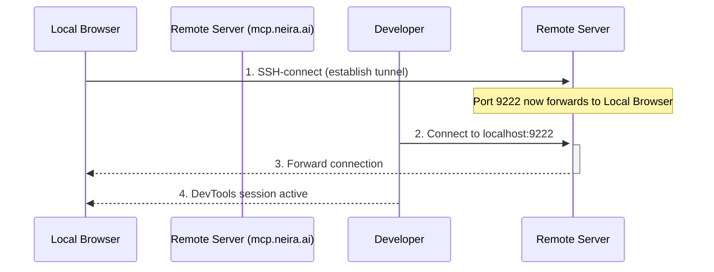

# 📖 Гайд: Использование Reverse SSH-туннеля в MCP

Версия: 1.0 (2025-06-19)
Статус: ✅ Актуально

Этот гайд объясняет, как использовать функцию обратного (Reverse) SSH-туннеля в MCP (Master Control Program) для безопасного удаленного доступа к вашему NEIRA Super App.

## ⚡️ Назначение

Reverse SSH-туннель позволяет создать защищенный канал от вашего локального экземпляра NEIRA Super App до удаленного сервера. Это дает возможность доверенным разработчикам или системам поддержки безопасно подключаться к вашему приложению для диагностики и отладки, даже если оно находится за файрволом или NAT.

## 🚀 Как это работает

1. **Инициация**: NEIRA Super App (клиент) инициирует SSH-соединение с удаленным сервером (например, `mcp.neira.ai`).
2. **Создание туннеля**: На удаленном сервере открывается порт, который перенаправляет весь трафик через установленное SSH-соединение обратно на локальный порт вашего NEIRA Super App.
3. **Удаленный доступ**: Разработчик подключается к этому порту на удаленном сервере, получая доступ к интерфейсу отладки (например, Chrome DevTools) вашего браузера.

## 🛠️ Настройка и использование

Функция управляется через `MCPManager` и настраивается в конфигурационном файле.

1. **Включите в конфигурации**: Убедитесь, что в вашем файле настроек MCP опция `reverseSshTunnel.enabled` установлена в `true`.
2. **Укажите параметры сервера**: Заполните данные SSH-сервера: `host`, `port`, `username` и путь к приватному ключу (`privateKeyPath`).
3. **Запустите NEIRA Super App**: При запуске `MCPManager` автоматически попытается установить соединение и создать туннель.
4. **Проверьте логи**: В логах `MCPManager` вы увидите сообщения об успешном или неуспешном установлении туннеля.

## 🔒 Безопасность — это ключевое

Эта функция предоставляет мощные возможности, но требует строгого соблюдения мер безопасности.

- **Ключи доступа**: Используйте уникальные, защищенные паролем SSH-ключи. Никогда не храните ключи с открытым доступом в репозитории.
- **Доверенные серверы**: Подключайтесь только к доверенным и защищенным SSH-серверам.
- **Минимальные привилегии**: SSH-пользователь на удаленном сервере должен иметь минимально необходимые права.
- **Временный доступ**: Включайте туннель только на время сессии отладки и отключайте его после завершения.

---

_Помните: предоставляя доступ через Reverse SSH, вы открываете "дверь" в ваше приложение. Убедитесь, что вы доверяете серверу и тем, кто имеет к нему доступ._
