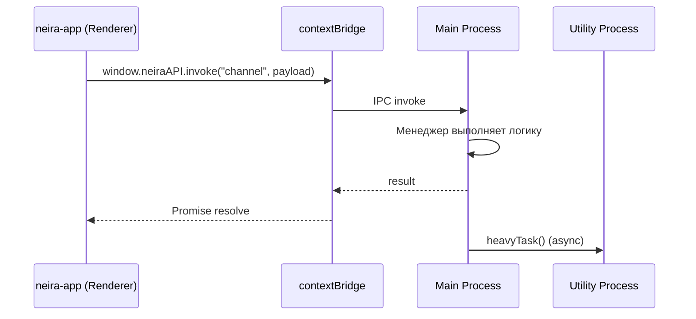
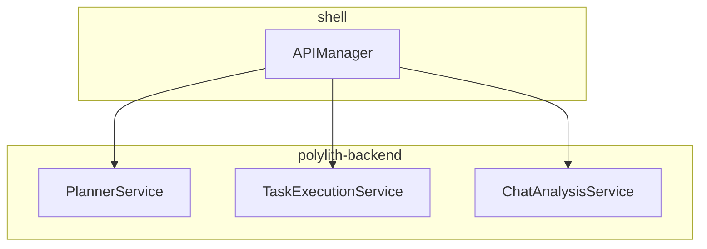

# 🏗️ Архитектура NEIRA Super App – Обзор

> **Status:** Stable · **Last updated:** 2025-07-01  
> **Единый источник правды по архитектуре платформы**

## Обзор: Super App 2.0

NEIRA Super App — это модульная платформа _Super App 2.0_, построенная на надёжном ядре-«операционной системе» (`shell`) и полностью статическом UI-слое (`neira-app`). Двухуровневый дизайн обеспечивает безопасность, производительность и масштабируемость.

### Архитектурные слои

| Слой               | Пакет                       | Краткое описание                                                                                                                                        |
| ------------------ | --------------------------- | ------------------------------------------------------------------------------------------------------------------------------------------------------- |
| **Core / Shell**   | `packages/shell`            | Electron-приложение, построенное по _Manager Architecture_. Управляет окнами, вкладками, IPC-каналами, безопасностью и фоновыми процессами.             |
| **UI**             | `packages/neira-app`        | Статическое Next.js 15-приложение (output: `export`). Не содержит сервера, исполняется через протокол `neira://`. Получает данные исключительно по IPC. |
| **Business Logic** | `packages/polylith-backend` | Polylith-монорепозиторий с независимыми компонентами (Chat, AI, MCP и т. д.). Логика переиспользуема за пределами Electron.                             |

### Поток данных (упрощённая схема)



## Ключевые архитектурные принципы

### 1. Manager Architecture 2.0

Главный процесс декомпозирован на специализированные менеджеры с четким жизненным циклом:

- **WindowManager** – окна & WebContentsView
- **TabManager** – жизненный цикл вкладок
- **IPCManager** – регистрация/маршрутизация каналов
- **APIManager** – _тонкий прокси_ для делегирования в polylith-backend

> **Детали:** [Manager Architecture](/03-core-concepts/1-architecture-patterns/04-manager-architecture)

### 2. Паттерн "Тонкий прокси" (2025 рефакторинг)

> **Обновлено:** 2025-07-01 — Завершен рефакторинг APIManager

**APIManager** упрощен с 1400+ до ~400 строк, работает как "тонкий прокси":

```typescript
// ✅ НОВЫЙ подход: APIManager как тонкий прокси
class APIManager {
  constructor() {
    this.taskExecutionService = new TaskExecutionService(...);
  }

  async handleChat(request) {
    const execResult = await this.taskExecutionService.execute({ tool: toolName, params: args });
    return backendAdapters.textGeneration.generateText(request);
  }
}
```

**Ключевые достижения рефакторинга (2025-07-01):**

- ✅ **AIGenerationService** полностью мигрирован в `polylith-backend`
- ✅ **TaskExecutionService** активно используется для выполнения инструментов
- ✅ **PolylithChatService** централизует работу с БД чатов
- ✅ **APIManager** сокращен до роли "тонкого прокси" (~400 строк)
- ✅ **Модульность:** Каждый сервис имеет четкую ответственность
- ✅ **Тестируемость:** Отдельные unit-тесты для каждого компонента

### Метрики производительности (2025)

**Оптимизация зависимостей (январь 2025):**
| Метрика | До | После | Улучшение |
|---------|----|----|-----------|
| Размер node_modules | 1.2GB | 780MB | 35% ↓ |
| Время сборки | 2m 30s | 1m 15s | 50% ↓ |
| Холодный старт | 2.5s | 0.3s | 88% ↓ |

**Интеграция компонентов (июнь 2025):**
| Метрика | До | После | Улучшение |
|---------|----|----|-----------|
| Memory Usage | 420MB | 300MB | 29% ↓ |
| CPU Load | 35% | 22% | 37% ↓ |

### 3. VS Code-архитектура (Static + IPC)

- **Статическая сборка**: `neira-app` как набор статических файлов
- **Протокол `neira://`**: Специальный протокол обслуживания
- **IPC API**: Все вызовы через IPC вместо HTTP

_Детальная архитектура VS Code в разработке_

### 4. Polylith для бизнес-логики

> **Обновлено:** 2025-07-01 — Прогресс миграции

Бизнес-логика организована по архитектуре **Polylith**:



**Статус миграции:**

- ✅ AIGenerationService мигрирован
- ✅ TaskExecutionService активно используется
- ⏳ PlannerService в процессе переноса

> **Детали:** [Polylith Architecture](/03-core-concepts/1-architecture-patterns/10-polylith-architecture)

## Режимы работы

| Режим         | Описание                                 | Ключевые особенности                                                                                                    |
| :------------ | :--------------------------------------- | :---------------------------------------------------------------------------------------------------------------------- |
| **Fast Mode** | Оптимизирован для максимальной скорости. | Создание вкладки мгновенно (~200ms), без активации Utility Processes и CDP.                                             |
| **Full Mode** | Предоставляет полную функциональность.   | Активирует Utility Processes для управления браузером (CDP), автоматизации рабочего стола (nut.js) и работы AI-агентов. |

## Быстрый старт

```bash
yarn start:fast  # Fast Mode (< 200ms вкладка)
yarn start:full  # Full Mode (с CDP и workers)
yarn dev:neira-app  # Только AI-приложение
```

### Основные правила разработки

1. **UI код** только в `packages/neira-app/` (запрещено SSR/API-Routes)
2. **IPC-каналы** описывать в `packages/shared-types` → автогенерация `allowed-channels.json`
3. **UI слой** в sandbox без прямого доступа к Node.js
4. **Ресурсоёмкие задачи** в Utility Processes

## Детальная документация

### Архитектурные паттерны

- 📋 [Manager Architecture](/03-core-concepts/1-architecture-patterns/04-manager-architecture)
- 🧱 [Polylith Architecture](/03-core-concepts/1-architecture-patterns/10-polylith-architecture)

### Компоненты системы

- 🖥️ [Shell Core](/03-core-concepts/2-shell-core/01-shell-architecture)
- 🎨 [UI Layer](/03-core-concepts/3-ui-layer/01-chat-architecture)
- 🤖 [AI Engine](/03-core-concepts/4-ai-engine/01-ai-architecture)

### Интеграции

- 🔌 [IPC Architecture](/03-core-concepts/2-shell-core/06-ipc-architecture)

---

_Архитектура: Production Ready. Рефакторинг 2025 года укрепил надёжность через TypeScript, Polylith миграцию и консолидацию IPC-каналов._
