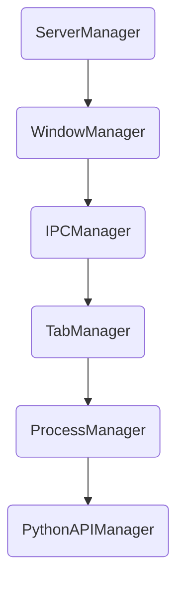

# 🏗️ Manager Architecture 2.0

## Обзор

NEIRA Super App использует **Manager Architecture 2.0**: каждый аспект главного процесса инкапсулирован в специализированном менеджере с чётким жизненным циклом (`initialize → isInitialized → cleanup`). Такой подход обеспечивает модульность, высокую тестируемость и изоляцию ошибок.

### Главные менеджеры

| Менеджер              | Ответственность                                                                          |
| --------------------- | ---------------------------------------------------------------------------------------- |
| **APIManager**        | Обработка AI-запросов (текст, инструменты) через `backendAdapters`                       |
| **BaseManager**       | Базовые методы (логирование, события, lifecycle)                                         |
| **WindowManager**     | Создание/управление главным окном и `WebContentsView` (Workbench UI)                     |
| **TabManager**        | Управление жизненным циклом вкладок и CDP-интеграцией                                    |
| **ServerManager**     | Запуск и контроль встроенного `NeiraServer` (SSR/статик)                                 |
| **ProcessManager**    | Управление Utility-процессами. См. [Архитектуру воркеров](/03-core-concepts/2-shell-core/09-workers-architecture) |
| **IPCManager**        | Централизованный роутинг IPC-сообщений от renderer-процессов                             |
| **ExtensionsManager** | Управление жизненным циклом Chrome-расширений и контекстных меню                         |
| **PythonAPIManager**  | Управление жизненным циклом внешнего Python-агента через gRPC                            |

### Архитектурные принципы

- **Модульность > Монолитность** — каждый менеджер изолирует доменную область.
- **Single Source of Truth (SSOT)** — состояние хранится в main-процессе; UI пассивно подписывается через события.
- **Dependency Injection** — менеджеры получают зависимости через конструктор.
- **Event-Driven** — коммуникация между менеджерами через события.
- **Lifecycle Management** — предсказуемый порядок запуска/остановки.
- **Корректное управление жизненным циклом**: Все менеджеры, наследующие `BaseManager`, должны корректно реализовывать метод `_destroy()`, чтобы обеспечить освобождение ресурсов (например, очистку таймеров `setInterval` и удаление слушателей событий) и предотвратить утечки памяти.
- **Итеративная миграция через "Адаптер"**: При переходе на новую архитектуру (например, Polylith) используется **паттерн "Адаптер"**. Создается единый интерфейс (`backendAdapters.ts`), который предоставляет доступ к функциям новой системы. Старый код (например, `APIManager`) постепенно переключается на использование этого адаптера, что позволяет проводить миграцию итеративно, не останавливая основную разработку.
- **SRP** — одна зона ответственности на класс.

### Порядок инициализации 2.0 (Core + Deferred)

Инициализация разделена на два этапа для максимально быстрого запуска UI.

1. **Core-менеджеры (мгновенно):**
   - `ProtocolHandler`
   - `WindowManager`
   - `IPCManager`
   - `TabManager`
   - `NavigationManager`
2. **Deferred-менеджеры (в фоне):**
   - `AudioManager`
   - `RecordingWindowManager`
   - `CodeOSSManager`
   - `APIManager`
   - `MCPManager`
   - `ProcessManager`
   - `ExtensionsManager`
   - `PythonAPIManager`

### Завершение работы (Graceful Shutdown)

Процесс завершения работы так же важен, как и инициализация, для предотвращения "зависших" процессов (livelock).

- **Централизованный вызов:** `super-app.ts` вызывает метод `shutdown()`, который проходит по всем менеджерам.
- **Обратный порядок:** Менеджеры уничтожаются в **строгом обратном порядке** их создания, чтобы избежать ошибок зависимостей.
- **Обязательный `_destroy()`:** Каждый менеджер _обязан_ реализовать метод `_destroy()`, в котором происходит полная очистка всех ресурсов: таймеров, сокетов, дочерних процессов, слушателей событий.
- **Защита от зависания:** В `main/index.ts` хук `before-quit` обернут в `Promise.race()` с таймаутом в 5 секунд. Если `shutdown()` не завершается за это время, приложение принудительно закрывается.

**Порядок уничтожения менеджеров:**

1. `processManager` (и дочерние процессы)
2. `pythonAPIManager`
3. `navigationManager`, `tabManager`, `ipcManager`
4. `recordingWindowManager`, `codeOSSManager`, `audioManager`
5. `extensionsManager`
6. `apiManager`, `mcpManager`
7. `windowManager`
8. `protocolHandler`

- **SRP** — одна зона ответственности на класс.

### Порядок инициализации



### Преимущества

- Лёгкая тестируемость модулей
- Изоляция ошибок
- Параллельная инициализация компонентов
- Graceful Degradation при сбоях одного менеджера

## 📊 Диаграммы взаимодействия

Для лучшего понимания потоков данных между менеджерами см. **[25-interaction-diagrams.md](/03-core-concepts/1-architecture-patterns/25-interaction-diagrams)** с наглядными Mermaid-диаграммами для ключевых сценариев:

- 💬 **Отправка сообщения в чат**: APIManager → PolylithChatService → MCPManager → AI Provider
- 🔌 **Подключение MCP-сервера**: MCPManager → EventSource → JSON-RPC → Tools Loading
- 🌐 **Создание вкладки**: TabManager → WebContentsView → CDP Integration → UI Updates

## TabManager: Множественные вкладки

**Ключевая особенность:** TabManager поддерживает Chrome-like поведение для вкладок "Новая вкладка".

### Принципы работы

- **Множественные newtab**: Можно создать любое количество вкладок `neira://view/newtab`
- **Защита от дубликатов**: Применяется только к обычным веб-сайтам, не к newtab
- **Горячие клавиши**: Cmd+T (новая), Cmd+W (закрыть), Cmd+1-9 (переход)

### Логика создания вкладок

```typescript
const isNewTabUrl = normalizedInputUrl === 'neira://view/newtab'
if (!isNewTabUrl) \{
  // Проверяем дубликаты только для обычных URL'ов
  const existingId = this.findTabByUrl(normalizedInputUrl)
}
```

**Результат:** Каждое нажатие "+" или Cmd+T создаёт новую независимую вкладку, производительность менее 200ms.

---

**Notes**

- Исторический контекст рефакторинга («монолитный SuperApp», этапы _Deprecate → Replace → Eradicate_) перенесён в `docs/fixes/legacy-superapp-refactor.md`.
- Документ описывает **текущее** состояние системы в соответствии с `docs/05-contributing/04-documentation-lifecycle.md`.

---
