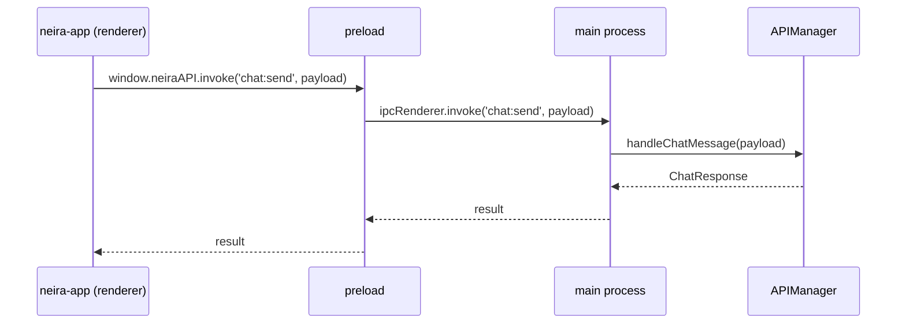

# 🏗️ VS Code-архитектура NEIRA Super App

> **Сводка:** NEIRA Super App рендерит UI как **статический пакет Next.js** и обслуживает его через собственный **`neira://` протокол**. Все действия выполняются через **IPC-API** без HTTP-серверов.

## Ключевые идеи

1. **Статический билд** (`output: 'export'`) — Next.js генерирует чистые html/js/css.
2. **Кастомный протокол** `neira://` — браузерный аналог `file://`, контролируемый main-процессом.
3. **IPC-API вместо REST** — любые данные/действия проходят через типизированные каналы Electron IPC.
4. **Zero Ports** — в production отсутствуют открытые порты; в dev возможен HTTP-fallback.

## Состав модулей

| Модуль                   | Файл                                             | Ответственность                                                              |
| ------------------------ | ------------------------------------------------ | ---------------------------------------------------------------------------- |
| **ProtocolHandler**      | `packages/shell/src/main/protocol-handler.ts`    | Разрешает URL `neira://…` → локальный путь к `neira-app/out`.                |
| **APIManager**           | `packages/shell/src/main/managers/APIManager.ts` | Централизует бизнес-логику и экспортирует IPC-хендлеры.                      |
| **Preload (IPC-bridge)** | `packages/shell/src/preload/index.ts`            | Экспорт `window.neiraAPI`, перехват `fetch`, безопасная маршрутизация в IPC. |
| **IPC клиент**           | `packages/neira-app/lib/ipc-api.ts`              | Типизированные запросы из React компонентов.                                 |

## Минимальный поток данных



## IPC-каналы (выборка)

| Канал         | Метод APIManager    | Возврат        |
| ------------- | ------------------- | -------------- |
| `chat:send`   | `handleChatMessage` | `ChatResponse` |
| `chats:list`  | `handleGetChats`    | `Chat[]`       |
| `models:list` | `handleGetModels`   | `Model[]`      |

## Dev ↔ Prod режимы

```bash
# Development (HTTP + hot-reload)
STATIC_MODE=0 yarn dev:neira-app && yarn start

# Production (Static + IPC)
yarn build          # генерирует neira-app/out
STATIC_MODE=1 yarn start
```

IPC-клиент автоматически выбирает transport:

```ts
export async function callAPI(endpoint: string, data?: unknown) \{
  if (typeof window !== 'undefined' && window.neiraAPI) \{
    return window.neiraAPI.invoke(endpoint, data)
  }
  return fetch(`/api/${endpoint}`, \{ method: 'POST', body: JSON.stringify(data) })
}
```

## Best Practices

- **Статические файлы + IPC > HTTP-сервер**: Для интеграции веб-приложений (как внутренних, так и сторонних) всегда предпочитайте архитектуру со статическими файлами, обслуживаемыми через кастомный протокол, и взаимодействием через IPC. Этот подход устраняет необходимость в открытых портах в production, повышает безопасность и производительность.
- **Инъекция `<base>` тега для сторонних приложений**: Вместо того чтобы исправлять URL ресурсов "на лету", инъектируйте в HTML-файл стороннего приложения тег `<base href="neira://your-app-root/">`. Это архитектурно правильный способ, который заставляет браузер корректно разрешать все относительные пути.
- **Централизованные IPC-каналы и типы**: Держите определения всех IPC-каналов и их типизацию в едином месте, например, в `shared-types/`, чтобы обеспечить консистентность между `main` и `renderer` процессами.
- **Пассивный UI (Passive-Store)**: Старайтесь не хранить бизнес-логику или долгоживущее состояние в renderer-процессе. Используйте UI-сторы (Zustand) только для эфемерного состояния, а основные данные получайте из `main` процесса через IPC-события.
- **Проверка статической сборки в CI**: Всегда проверяйте, что статическая сборка (`yarn build`) проходит успешно в рамках CI/CD пайплайна, чтобы избежать проблем в production.

---

**Верификация документа**

- **Дата проверки:** 2025-06-17
- **Проверил:** AI-Reviewer
- **Обоснование актуальности:** Файл отражает текущую реализацию `protocol-handler.ts`, `APIManager.ts` и unified preload (Phase 3 IPC рефакторинга). Упомянутые файлы существуют, функциональность активна в production. Дубликатов в `docs/` не обнаружено.

---
