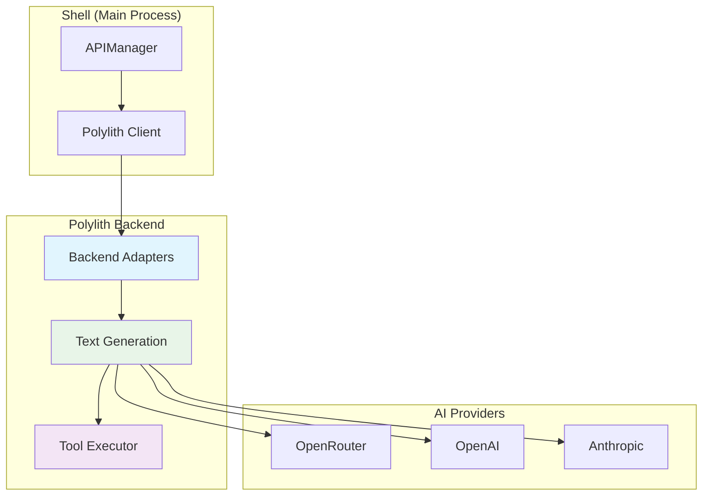

# 🧩 Polylith Architecture

**Версия:** 2025-08-05 **Статус:** ✅ Canonical

Этот документ описывает архитектуру Polylith в NEIRA Super App — модульную систему для обработки AI-запросов и инструментов.

---

## 1. Философия и принципы

Polylith в NEIRA Super App реализует принципы модульной архитектуры для AI-пайплайна:

1. **Единое выполнение** — каждая операция (включая tool_calls) выполняется только один раз
2. **Централизованная логика** — вся обработка инструментов происходит в Polylith-backend
3. **Типизированные адаптеры** — четкие интерфейсы для различных AI-провайдеров
4. **Отказоустойчивость** — graceful fallback при недоступности Polylith

**Принцип:** Polylith — это оркестратор AI-операций, а не дублирующий слой.

---

## 2. Архитектура компонентов



---

## 3. Жизненный цикл AI-запроса

### 3.1 Обработка с tool_calls

1. **Запрос от UI** → `APIManager.handleChat()`
2. **Проверка Polylith** → если доступен, передаем в `backendAdapters.textGeneration.generateText`
3. **Обработка инструментов** → `toolExecutor` выполняет все tool_calls в Polylith
4. **Возврат результата** → финальный ответ возвращается через единый канал

### 3.2 Принцип единого выполнения

```typescript
// APIManager.ts - правильный подход
const response = await this.polylithClient.backendAdapters.textGeneration.generateText({
  messages,
  toolExecutor, // ← Единственное место выполнения tool_calls
  model: selectedModel
})

// ❌ Неправильно: дублирование логики
// if (response.toolCalls) {
//   await this.executeToolCalls(response.toolCalls) // ← Дублирование!
// }
```

---

## 4. Решенные проблемы и рефакторинги

### 4.1 Унификация обработки tool_calls (POLYLITH:TOOL_CALLS_UNIFICATION)

**Проблема:** Дублирование выполнения `tool_calls` в APIManager и Polylith-backend приводило к race conditions.

**Решение:**

1. Удаление дублирующих блоков в APIManager
2. Единая точка выполнения в Polylith-backend
3. Проверка передачи `toolExecutor` во всех вызовах

**Результат:** Устранение race conditions, единая логика выполнения инструментов.

```typescript
// ✅ Правильно: единое выполнение в Polylith
const response = await this.polylithClient.backendAdapters.textGeneration.generateText({
  messages,
  toolExecutor, // ← Единственное место выполнения
  model: selectedModel
})

// ❌ Убрано: дублирующая логика
// if (response.toolCalls) {
//   await this.executeToolCalls(response.toolCalls) // ← Было дублирование!
// }
```

### 4.2 Принципы унифицированной обработки

| Принцип | Было (до унификации) | Стало (после унификации) |
|---------|---------------------|--------------------------|
| **Выполнение tool_calls** | В двух местах (APIManager + Polylith) | Только в Polylith |
| **Источник правды** | Двойной (флаг + логика) | Единый (toolExecutor в Polylith) |
| **Отладка** | Сложная из-за дублирования | Простая, один путь выполнения |
| **Race conditions** | Возможны | Исключены |

---

## 5. Лучшие практики

### 5.1 Правильные паттерны

| Контекст | Правильный подход | Пример |
|----------|-------------------|---------|
| AI-запрос с инструментами | Передача `toolExecutor` в Polylith | `generateText({ messages, toolExecutor })` |
| Обработка ответа | Прямое использование результата | `return response.text` |
| Ошибки Polylith | Graceful fallback на локальную логику | `if (!polylithAvailable) { /* fallback */ }` |
| Логирование | Централизованное в APIManager | `this.logger.info('Polylith response:', response)` |

### 5.2 Антипаттерны (устранены)

| ❌ Плохо (до унификации) | ✅ Хорошо (после унификации) |
|--------------------------|------------------------------|
| Дублирование tool_calls в APIManager | Единственное выполнение в Polylith |
| Условная логика с флагами | Всегда используем toolExecutor |
| Ручная обработка инструментов | Автоматическая в Polylith |
| Проверка результатов tool_calls | Доверие результату Polylith |

---

## 6. Конфигурация и настройка

### 6.1 Environment переменные

```typescript
// Конфигурация Polylith
const config = {
  USE_POLYLITH_AI_PIPELINE: true,  // Всегда включено после унификации
  POLYLITH_ENDPOINT: process.env.POLYLITH_ENDPOINT || 'http://localhost:3001',
  POLYLITH_TIMEOUT: 30000
}
```

### 6.2 Инициализация клиента

```typescript
// packages/shell/src/main/managers/APIManager.ts
class APIManager extends BaseManager {
  private polylithClient: PolylithClient

  async _initialize() {
    this.polylithClient = new PolylithClient({
      endpoint: config.POLYLITH_ENDPOINT,
      timeout: config.POLYLITH_TIMEOUT
    })
    
    // Проверка доступности
    try {
      await this.polylithClient.healthCheck()
      this.logger.info('✅ Polylith-backend доступен')
    } catch (error) {
      this.logger.warn('⚠️ Polylith-backend недоступен, используем fallback')
    }
  }
}
```

---

## 7. Troubleshooting

### 7.1 Частые проблемы

| Проблема | Причина | Решение |
|----------|---------|---------|
| Дублирование tool_calls | Старая логика в APIManager | Убедиться что tool_calls НЕ обрабатываются в APIManager |
| Инструменты не выполняются | Отсутствует toolExecutor | Всегда передавать toolExecutor в generateText |
| Timeout ошибки | Долгие AI-запросы | Увеличить POLYLITH_TIMEOUT |
| Fallback не работает | Неправильная обработка ошибок | Проверить try/catch вокруг Polylith вызовов |

### 7.2 Диагностика

```typescript
// Логирование для отладки
this.logger.debug('Sending to Polylith:', {
  messages: messages.length,
  hasToolExecutor: !!toolExecutor,
  model: selectedModel
})

const response = await this.polylithClient.backendAdapters.textGeneration.generateText({
  messages,
  toolExecutor,
  model: selectedModel
})

this.logger.debug('Polylith response:', {
  hasText: !!response.text,
  toolCallsExecuted: response.toolCallsExecuted || 0,
  processingTime: response.metadata?.processingTime
})
```

---

## 8. Revision History

| Дата | Версия | Изменение | ID Знания |
|------|--------|-----------|-----------|
| 2025-08-05 | 1.0 | Создание канонического документа с унификацией tool_calls | POLYLITH:TOOL_CALLS_UNIFICATION |

---

## 9. Связанные документы

- [Manager Architecture](/core-concepts/architecture-patterns/manager-architecture) — Роль Polylith в менеджерах
- [AI Engine](/core-concepts/ai-engine/ai-architecture) — Интеграция с AI-пайплайном
- [API Management](/core-concepts/shell-core/api-management) — Взаимодействие через APIManager
