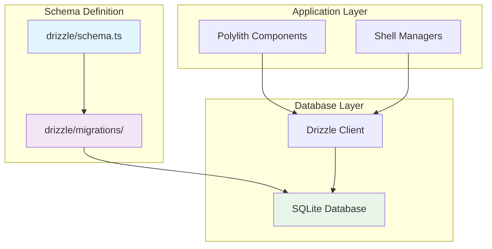

# 🗃️ Database Architecture

**Версия:** 2025-08-05 **Статус:** ✅ Canonical

Этот документ описывает архитектуру управления базами данных в NEIRA Super App, включая миграции, схемы и управление состоянием.

---

## 1. Философия и принципы

База данных в NEIRA Super App управляется принципом **единого источника правды (SSOT)** для схемы:

1. **Drizzle ORM** — единственный инструмент для управления схемой и миграций
2. **Код-первый подход** — схема определяется в TypeScript, миграции генерируются автоматически  
3. **Версионный контроль** — все изменения схемы отслеживаются через Git
4. **Автоматизация** — миграции применяются автоматически в CI/CD

**Принцип:** Никаких ручных изменений схемы, никаких альтернативных способов создания таблиц.

---

## 2. Архитектура компонентов



---

## 3. Структура проекта

```
packages/neira-app/
├── drizzle/
│   ├── schema.ts              # Определение схемы в TypeScript
│   ├── migrations/            # Автогенерированные SQL-миграции
│   │   ├── 0001_initial.sql
│   │   └── 0002_add_users.sql
│   └── drizzle.config.ts      # Конфигурация Drizzle
├── lib/
│   └── db/
│       ├── client.ts          # Клиент для подключения к БД
│       └── queries.ts         # Типизированные запросы
└── data/
    └── neira.db              # SQLite файл базы данных
```

---

## 4. Миграции и управление схемой

### 4.1 Жизненный цикл схемы

1. **Определение:** Схема определяется в `drizzle/schema.ts` с использованием Drizzle типов
2. **Генерация:** Команда `yarn db:generate` создает SQL-миграции
3. **Применение:** Команда `yarn db:migrate` применяет миграции к базе данных
4. **Валидация:** CI/CD автоматически проверяет и применяет миграции

### 4.2 Команды управления

```bash
# Генерация новой миграции после изменения схемы
yarn db:generate

# Применение всех неприменённых миграций
yarn db:migrate

# Открытие Drizzle Studio для просмотра данных
yarn db:studio

# Сброс базы данных (ОСТОРОЖНО!)
yarn db:reset
```

### 4.3 Пример схемы

```typescript
// drizzle/schema.ts
import { sqliteTable, text, integer } from 'drizzle-orm/sqlite-core'

export const users = sqliteTable('users', {
  id: integer('id').primaryKey(),
  name: text('name').notNull(),
  email: text('email').unique().notNull(),
  createdAt: integer('created_at', { mode: 'timestamp' }).notNull()
})

export const chats = sqliteTable('chats', {
  id: text('id').primaryKey(),
  userId: integer('user_id').references(() => users.id),
  title: text('title').notNull(),
  createdAt: integer('created_at', { mode: 'timestamp' }).notNull()
})
```

---

## 5. Решенные проблемы и рефакторинги

### 5.1 Устранение двойных источников схемы (DATABASE:SCHEMA_UNIFICATION)

**Проблема:** Функция `ensureDatabaseSchema()` в polylith-backend автоматически создавала таблицы SQLite, конфликтуя с системой миграций Drizzle, создавая два источника правды и риск рассинхронизации схемы.

**Решение:**

1. Удалена функция `ensureDatabaseSchema` и её вызов
2. Удален неиспользуемый импорт `SQLiteDatabase`
3. Добавлен `sqlite.pragma('foreign_keys = ON')` для обеспечения целостности
4. В CI/CD добавлен шаг `Run database migrations` в `.github/workflows/build.yml`
5. В troubleshooting-гайд добавлен раздел об обязательных миграциях

**Результат:**

- ✅ Схема БД управляется только Drizzle Migrations
- ✅ Пайплайн сборки автоматически применяет миграции  
- ✅ Код чище без дублирования SQL
- ✅ Валидация файла БД в CI/CD
- ✅ Устранен риск рассинхронизации между кодом и схемой БД

### 5.2 Принципы единого источника правды

| Принцип | Было (до рефакторинга) | Стало (после рефакторинга) |
|---------|------------------------|----------------------------|
| **Создание таблиц** | `ensureDatabaseSchema()` + Drizzle | Только Drizzle migrations |
| **Источник правды** | Двойной (код + SQL) | Единый (TypeScript схема) |
| **Валидация** | Ручная | Автоматическая в CI/CD |
| **Применение миграций** | Ручное | Автоматическое |

---

## 6. Лучшие практики

### 6.1 Правильные паттерны

| Контекст | Правильный подход | Пример |
|----------|-------------------|---------|
| Изменение схемы | Модификация `schema.ts` + генерация миграции | `yarn db:generate` |
| Запросы к БД | Типизированные Drizzle запросы | `db.select().from(users).where(eq(users.id, 1))` |
| Инициализация БД | Применение миграций | `yarn db:migrate` |
| Разработка | Использование Drizzle Studio | `yarn db:studio` |

### 6.2 Антипаттерны (устранены)

| ❌ Плохо (до рефакторинга) | ✅ Хорошо (после рефакторинга) |
|----------------------------|--------------------------------|
| Ручное создание таблиц в коде | Генерация через Drizzle migrations |
| SQL-запросы строками | Типизированные Drizzle queries |
| Два источника схемы | Единый source of truth в TypeScript |
| Игнорирование миграций | Обязательные миграции в CI/CD |

---

## 7. CI/CD интеграция

### 7.1 GitHub Actions

```yaml
# .github/workflows/build.yml
- name: Run database migrations
  run: |
    yarn db:migrate
    # Валидация что файл БД создан корректно
    if [ ! -f "packages/neira-app/data/neira.db" ]; then
      echo "Database file not found after migration"
      exit 1
    fi
```

### 7.2 Автоматические проверки

- ✅ **Syntax validation** — проверка корректности SQL в миграциях
- ✅ **Schema consistency** — сравнение TypeScript схемы и применённых миграций  
- ✅ **Foreign keys** — включение проверки целостности данных
- ✅ **Database file validation** — проверка создания файла БД

---

## 8. Troubleshooting

### 8.1 Частые проблемы

| Проблема | Причина | Решение |
|----------|---------|---------|
| Migration не применяется | Неактуальная схема | Запустить `yarn db:generate && yarn db:migrate` |
| Foreign key constraints | Отключены FK | Добавить `pragma('foreign_keys = ON')` |
| Database locked | Открытые соединения | Закрыть все подключения к БД |
| Schema drift | Ручные изменения БД | Пересоздать БД из миграций |

### 8.2 Диагностика

```bash
# Проверка состояния миграций
yarn drizzle-kit introspect:sqlite

# Проверка различий между схемой и БД
yarn drizzle-kit check:sqlite

# Сброс и пересоздание БД
rm packages/neira-app/data/neira.db
yarn db:migrate
```

---

## 9. Performance и оптимизация

### 9.1 Индексы

```typescript
// Правильное создание индексов в схеме
export const users = sqliteTable('users', {
  // ...
}, (table) => ({
  emailIdx: index('email_idx').on(table.email),
  createdAtIdx: index('created_at_idx').on(table.createdAt)
}))
```

### 9.2 Конфигурация SQLite

```typescript
// lib/db/client.ts
import { drizzle } from 'drizzle-orm/better-sqlite3'
import Database from 'better-sqlite3'

const sqlite = new Database('data/neira.db')

// Оптимизация производительности
sqlite.pragma('journal_mode = WAL')
sqlite.pragma('synchronous = NORMAL')
sqlite.pragma('foreign_keys = ON')
sqlite.pragma('temp_store = MEMORY')

export const db = drizzle(sqlite)
```

---

## 10. Revision History

| Дата | Версия | Изменение | ID Знания |
|------|--------|-----------|-----------|
| 2025-08-05 | 1.0 | Создание канонического документа, интеграция схемных принципов | DATABASE:SCHEMA_UNIFICATION |

---

## 11. Связанные документы

- [Polylith Architecture](/03-core-concepts/1-architecture-patterns/10-polylith-architecture) — Использование БД в компонентах
- [Code Organization](/03-core-concepts/1-architecture-patterns/03-code-organization) — Структура данных в проекте
- [Security Principles](/03-core-concepts/1-architecture-patterns/08-security-principles) — Безопасность БД
