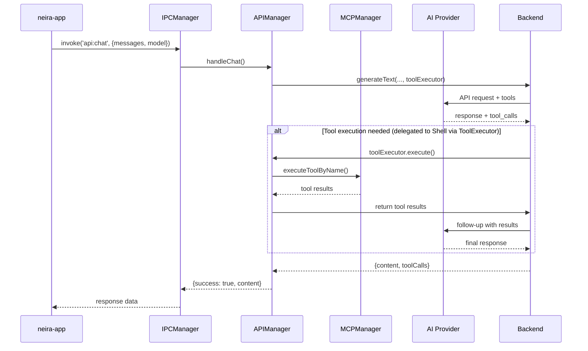
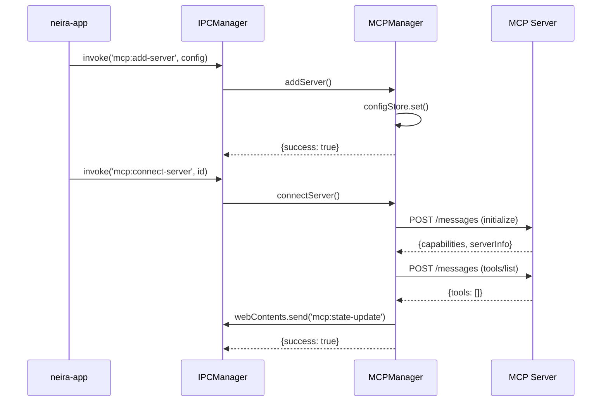
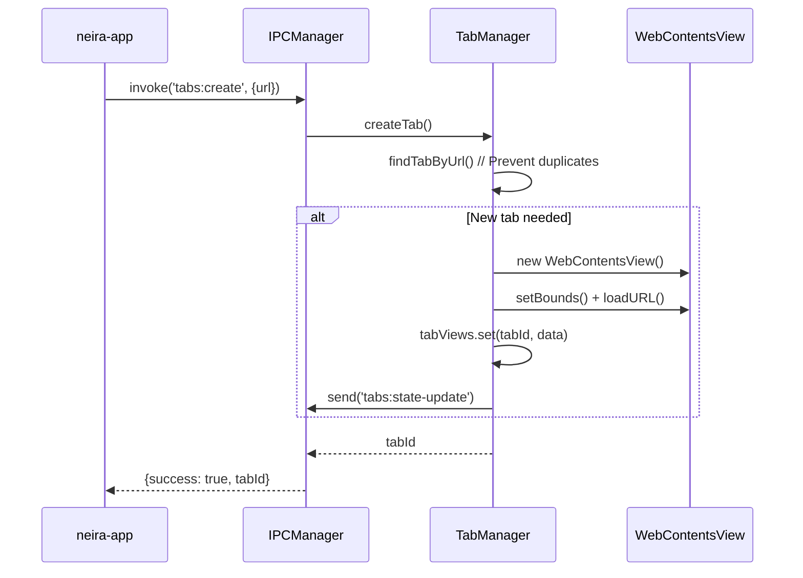

# 🎯 Диаграммы взаимодействия менеджеров

**Версия:** 1.0 | **Статус:** ✅ Стандарт | **Дата сжатия:** 2025-06-21

## ⚡ Философия

Менеджеры NEIRA взаимодействуют через четкие IPC-каналы и event-driven архитектуру. Эти диаграммы - **единственный источник правды** о потоках данных в системе. Связь с [Manager Architecture](/core-concepts/architecture-patterns/manager-architecture) и [IPC Architecture](/core-concepts/shell-core/ipc-architecture).

## 🏗️ Архитектура системы

```mermaid
graph TB
    subgraph "🖥️ Main Process (shell)"
        IPCMgr[IPCManager<br/>📡 IPC Router]
        API[APIManager<br/>🤖 AI Proxy]
        MCP[MCPManager<br/>🔌 MCP Tools]
        TM[TabManager<br/>🗂️ Browser Tabs]
        PM[ProcessManager<br/>⚙️ Workers]
    end

    subgraph "🎨 Renderer"
        UI[neira-app<br/>Next.js UI]
    end

    subgraph "⚙️ Workers"
        BW[browser-worker<br/>🌐 CDP]
        AC[agent-core<br/>🤖 gRPC]
    end

    subgraph "🔌 External"
        MCPS[MCP Servers<br/>🛠️ Tools]
        AIP[AI Providers<br/>🧠 LLMs]
    end

    UI <-->|IPC| IPCMgr
    IPCMgr --> API
    IPCMgr --> MCP
    IPCMgr --> TM
    API --> MCP
    API --> AIP
    MCP <-> MCPS
    PM --> BW
    PM --> AC

    class IPCMgr,API,MCP,TM,PM fill:#e1f5fe
    class UI fill:#f3e5f5
    class BW,AC fill:#fff3e0
    class MCPS,AIP fill:#e8f5e8
```

## 💬 AI Chat Flow



## 🔌 MCP Connection Flow



## 🌐 Tab Creation Flow



## 🎯 Архитектурные принципы

### SSOT (Single Source of Truth)

- **MCPManager** → состояние MCP-серверов
- **TabManager** → состояние вкладок
- **APIManager** → координация AI-запросов

### IPC-First Communication

- Все взаимодействие `neira-app ↔ shell` только через типизированные каналы
- Безопасность через изоляцию процессов
- TypeScript типы в `shared-types`

### Manager Isolation

- Четкие зоны ответственности
- Event-driven коммуникация
- Dependency injection через конструкторы

## 🛠️ Практические правила

### Для разработчиков

1. **Следуйте диаграммам** при добавлении новых потоков
2. **IPC-First** — никаких прямых вызовов между процессами
3. **Используйте паттерны** из существующих диаграмм

### Для code review

1. **Проверьте соответствие** установленным потокам
2. **Убедитесь в error handling** на каждом уровне
3. **Валидируйте типизацию** IPC каналов

---

**Примечание:** Диаграммы отражают архитектуру v2.0 после Polylith миграции. При изменениях архитектуры обновляйте диаграммы соответственно.
