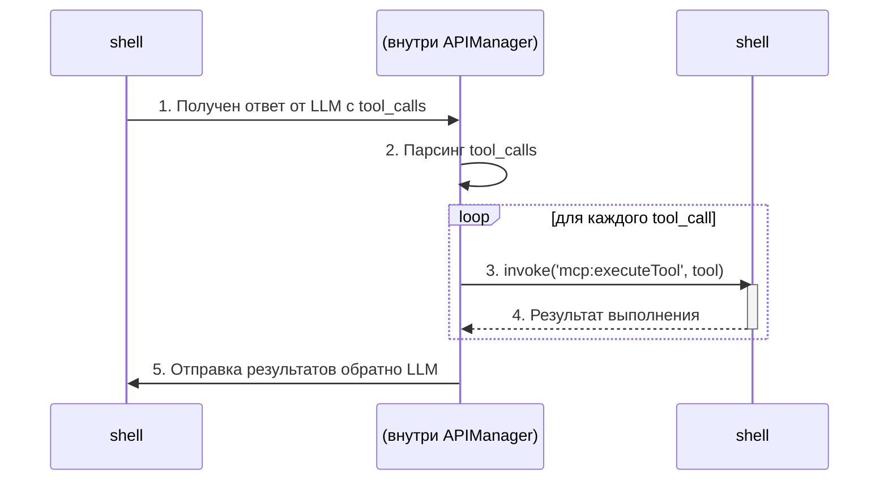

# Управление API (APIManager)

## Метаданные

- **Статус:** Актуально
- **Версия:** 2.0.0 (после миграции на Polylith)
- **Дата создания:** 2025-07-01
- **Авторы:** DocBuilder AI Assistant

## 📝 Обзор

`APIManager` — это центральный маршрутизатор в `shell` для всех запросов, связанных с AI и бизнес-логикой. После завершения миграции на `polylith-backend` его основная роль — не исполнение логики, а делегирование запросов специализированным сервисам и компонентам Polylith.

## 🏛️ Архитектура после миграции

**Исторический контекст:** Ранее `APIManager` содержал значительный объем бизнес-логики для взаимодействия с AI-провайдерами. В рамках рефакторинга вся эта логика была вынесена в `@neira/polylith-backend` для улучшения модульности и тестируемости.

**Текущая архитектура:**
1.  **`APIManager` как "тонкий" маршрутизатор:** Принимает IPC-запросы от `IPCManager` и немедленно передает их соответствующему сервису. Например, все запросы к чату (`/api/chats/*`) обрабатываются через `PolylithChatService`.
2.  **`polylith-backend` как "мозг":** Вся логика генерации текста, управления моделями, взаимодействия с внешними API (OpenAI, Gladia) и выполнения задач инкапсулирована в компонентах (Bricks) и сервисах Polylith.
3.  **Отсутствие feature-флагов:** Старый код и флаг `USE_POLYLITH_AI_PIPELINE` были полностью удалены. Новый пайплайн является стандартным и единственным.

### Пример текущего потока данных

```typescript
// packages/shell/src/main/managers/APIManager.ts

// 1. APIManager получает запрос
async handleChats(request: ApiRequest): Promise<unknown> {
  const { userId, chatId } = this.parseRequest(request);

  // 2. Логирует и немедленно делегирует вызов в PolylithChatService
  this.logger.info(`[Chats API] Handling request via PolylithChatService for user: ${userId}`);
  
  // 3. PolylithChatService содержит всю логику для работы с базой данных и возвращает результат
  if (chatId) {
    return this.chatService.getChatById(chatId, userId);
  } else {
    return this.chatService.getChats(userId);
  }
}
```

## ✅ Результаты миграции

1.  **Четкое разделение ответственности:** `APIManager` отвечает только за маршрутизацию, а `polylith-backend` — за исполнение.
2.  **Улучшенная тестируемость:** Компоненты Polylith можно тестировать в изоляции.
3.  **Повышенная надежность:** Устранено дублирование кода и сложные условные переходы.

## ⚙️ Управление системными промптами

**Проблема:** Большие текстовые блоки, такие как системные промпты, были жестко закодированы в методах `APIManager`, что ухудшало читаемость и усложняло их редактирование.

**Решение:**
1.  **Вынесение в отдельные файлы:** Все большие системные промпты должны храниться в отдельных файлах (`.md` или `.txt`) в соответствующей директории (например, `packages/shell/resources/prompts/`).
2.  **Загрузка при инициализации:** Менеджер, использующий промпт, должен загружать его содержимое из файла при инициализации (в методе `_initialize()`).

Это делает код чище, а промпты — легче для чтения и модификации без необходимости перекомпиляции кода.

# 🏛️ Управление API (`APIManager`)

`APIManager` является центральным узлом для всех взаимодействий с внешними и внутренними API, связанными с искусственным интеллектом. Он инкапсулирует логику общения с различными AI-провайдерами (OpenAI, OpenRouter, и т.д.) и предоставляет унифицированный интерфейс для остальной части приложения.

## 🎯 Ключевые обязанности

- **Агрегация AI-провайдеров**: `APIManager` содержит в себе "клиенты" для каждого поддерживаемого AI-сервиса.
- **Маршрутизация запросов**: На основе выбранной модели (например, `gpt-4o-mini` или `openrouter/meta-llama/llama-3-8b-instruct`), менеджер определяет, какой клиент должен обработать запрос.
- **Подготовка контекста**: Собирает историю сообщений, системные промпты и доступные "инструменты" (tools) для передачи в AI-модель.
- **Обработка ответов**: Управляет как обычными (буферизованными), так и потоковыми (streaming/SSE) ответами от AI.
- **Обработка вызовов инструментов**: Если AI-модель решает использовать инструмент, `APIManager` координирует его выполнение.

## ⚙️ Архитектура

`APIManager` является одним из ключевых менеджеров в `shell` и тесно взаимодействует с:

- **`IPCManager`**: Для получения запросов от `neira-app` (UI) через канал `api:chat`.
- **`MCPManager`**: Для получения списка доступных инструментов (tools) с MCP-серверов.
- **`OpenRouterModelService`**: Для получения списка доступных моделей и их характеристик.

## 🌊 Потоковая передача (Streaming)

Одной из важнейших функций `APIManager` является поддержка реального SSE-стриминга.

- Методы `streamOpenAIResponse()` и `streamOpenRouterResponse()` обрабатывают потоковые ответы от API.
- Токены отправляются в `neira-app` по одному через IPC-событие `chat:stream-chunk`, обеспечивая плавное отображение ответа в реальном времени.
- Реализован Graceful Fallback к буферному режиму, если стриминг по какой-то причине не удался.

Это позволяет избежать блокировки UI и создает отзывчивый пользовательский интерфейс.

### Детальная реализация SSE-стриминга

NEIRA Super App поддерживает настоящий Server-Sent Events (SSE) стриминг для двух основных провайдеров, заменив симуляцию стриминга на реальные потоки токенов.

#### OpenAI SSE — `streamOpenAIResponse()`

**Условия активации:**

- Модели с префиксом `gpt-*` (например, `gpt-4o-mini`, `gpt-4-turbo`)
- Наличие `OPENAI_API_KEY` в переменных окружения
- Параметр `streamProtocol: "data"` в запросе
- Отсутствие proxy-режима (`!shouldUseProxyForRequest`)

**Технические детали:**

- **Endpoint**: `https://api.openai.com/v1/chat/completions`
- **Поток**: ReadableStream → парсинг `data:` строк → JSON delta parsing → IPC-события
- **Graceful Fallback**: при ошибке SSE автоматический откат к буферному режиму

#### OpenRouter SSE — `streamOpenRouterResponse()`

**Условия активации:**

- Модели с `/` в названии (например, `meta-llama/llama-3.1-8b-instruct:free`)
- Исключены `gpt-*` и `claude-*` модели (они обрабатываются отдельно)
- Наличие `OPENROUTER_API_KEY` в переменных окружения

**Технические детали:**

- **Endpoint**: `https://openrouter.ai/api/v1/chat/completions`
- **Специальные заголовки**:
  - `HTTP-Referer: https://neira.app`
  - `X-Title: Neira Super App`
- **Graceful Fallback**: при неудаче стрима переход к стандартной логике

#### Архитектура IPC-событий

**Канал**: `chat:stream-chunk`

**Payload структура**:

```typescript
{
  chatId: string,
  requestId: string,
  chunk: StreamChunk
}
```

**Типы чанков**:

- `{ type: 'token', content: string }` — промежуточные токены для live-отображения
- `{ type: 'final', content: string }` — финальный полный ответ

**Фильтрация на клиенте**:
В `useNeiraChat` реализована умная фильтрация — промежуточные токены фильтруются по `requestId` (чтобы избежать смешивания разных запросов), но финальные чанки принимаются всегда (для гарантированной доставки ответа).

```typescript
// Frontend фильтрация в useNeiraChat.ts
if (
  payload?.chunk?.type === 'token' &&
  currentRequestIdRef.current &&
  payload?.requestId &&
  payload.requestId !== currentRequestIdRef.current
) {
  return // Игнорируем чужие промежуточные токены
}
// Финальные чанки обрабатываются всегда
```

#### Преимущества реализации

1. **Реальный real-time**: Убрана искусственная задержка симуляции (30ms/токен → мгновенно)
2. **Надежность**: Graceful fallback гарантирует получение ответа даже при проблемах со стримингом
3. **Масштабируемость**: Архитектура легко расширяется для добавления новых провайдеров (например, Anthropic Claude)
4. **Типизация**: Полная типизация IPC-событий через `shared-types`

**Версия:** 1.0 | **Статус:** ✅ Стандарт | **Дата создания:** 2025-07-01

Этот документ описывает `APIManager`, который является центральным шлюзом для всех взаимодействий с внешними AI API в `shell`. Он абстрагирует сложность работы с различными провайдерами (OpenAI, OpenRouter) и предоставляет унифицированный интерфейс для других частей системы.

**Связанные документы:**

- [Архитектура Менеджеров](/03-core-concepts/1-architecture-patterns/04-manager-architecture)
- [Интеграция MCP](/04-reference/04-mcp-integration)
- [Архитектура IPC](/03-core-concepts/2-shell-core/06-ipc-architecture)

## 🎯 Ключевые принципы

1. **Единая точка входа**: Весь код, который обращается к LLM, должен делать это через `APIManager`. Прямые вызовы `fetch` к API провайдеров из других частей `shell` запрещены.
2. **Абстракция провайдеров**: `APIManager` скрывает детали реализации для конкретных API, позволяя остальной части системы работать с единым методом `call`.
3. **Streaming-First**: По умолчанию все ответы от моделей передаются в UI потоково (SSE), обеспечивая лучший пользовательский опыт. Буферизованный ответ используется только как fallback.
4. **Безопасность**: Ключи API надежно хранятся и никогда не передаются в renderer-процесс. `APIManager` добавляет их в запросы непосредственно перед отправкой.

## 🚀 Обязанности `APIManager`

### 1. Маршрутизация запросов к AI

`APIManager.call()` — это основной метод, который выполняет следующие действия:

- Принимает запрос от `ChatService`.
- Определяет провайдера на основе префикса модели (например, модели с `"/"` направляются в OpenRouter).
- Вызывает соответствующий внутренний метод (`streamOpenAIResponse` или `streamOpenRouterResponse`).

### 2. Потоковая передача ответов (SSE)

Это основная функция `APIManager`.

- **`streamOpenAIResponse` / `streamOpenRouterResponse`**:
  1. Устанавливают SSE-соединение с API провайдера.
  2. Парсят входящие события (`event: message`, `event: data`).
  3. Преобразуют их в унифицированный формат `StreamChunk`.
  4. Отправляют каждый `StreamChunk` в `neira-app` через IPC-канал `chat:stream-chunk`.
- **Обработка `[DONE]`**: Корректно обрабатывает завершающее сообщение от API.
- **Graceful Fallback**: В случае ошибки потоковой передачи, `APIManager` автоматически переключается на буферизованный запрос, чтобы пользователь все равно получил ответ.

### 3. Выполнение инструментов (Tool Calling)

`APIManager` тесно интегрирован с `MCPManager` для выполнения инструментов.



### 4. Управление ключами API

- **Получение**: `APIManager` запрашивает необходимые ключи API у `CredentialsManager` при инициализации.
- **Использование**: Безопасно добавляет `Authorization` заголовки в исходящие `fetch` запросы.

## 🔄 Диаграмма потока данных (Streaming)

```