**Версия:** 3.1 (Компактная)  
**Статус:** ✅ **Действующий стандарт**  
**Обновлено:** 2025-06-30 (DOCBUILDER рефакторинг)

## ⚡ Философия

Межпроцессное взаимодействие (IPC) — это нервная система Electron-приложения. В NEIRA Super App мы используем модульную архитектуру **Channel Groups** вместо монолитного `IPCManager`.

**Источник правды (SSOT):** `shell` (main-процесс) — единственный источник правды. `neira-app` (renderer-процесс) только отправляет запросы и отображает состояние.

## 📖 Модули архитектуры

### 🏛️ [Основы Channel Groups](/03-core-concepts/2-shell-core/ipc-architecture/01-channel-groups-basics)

- Архитектурные принципы и структура групп каналов
- IPCManager как дирижер, диаграммы взаимодействия

### 🔄 Поток обработки запросов

- Жизненный цикл IPC-запроса от UI до бизнес-логики
- Обработка ошибок и валидация

*Подробное руководство в разработке*

### 📝 Определение и регистрация каналов

- Единый источник правды в shared-types
- Автоматическая генерация конфигурации

*Подробное руководство в разработке*

### 🧪 Тестирование IPC

- Интеграционные тесты каналов и валидация регистрации

*Подробное руководство в разработке*

### 🔧 Практические примеры

- TabChannels, WindowChannels, VoiceChannels реализации

*Подробное руководство в разработке*

### 📊 Мониторинг и отладка

- Логирование IPC-вызовов и метрики производительности

*Подробное руководство в разработке*

## 🚀 Быстрый старт

**Создание новой группы каналов:**

1. **Определите каналы** в `shared-types` → См. раздел "Определение и регистрация каналов" выше
2. **Создайте группу** в `shell/managers/channels/` → [Структура групп](/03-core-concepts/2-shell-core/ipc-architecture/01-channel-groups-basics)
3. **Зарегистрируйте в IPCManager** → См. раздел "Поток обработки запросов" выше
4. **Создайте клиент** в `neira-app/lib/ipc-api.ts` → См. раздел "Практические примеры" выше

## 🎯 Ключевые принципы

- **Модульность**: Каждая группа каналов отвечает за свой домен
- **Типобезопасность**: Все каналы типизированы через shared-types
- **Единый источник правды**: Main-процесс владеет состоянием
- **Тестируемость**: Каждая группа легко тестируется изолированно

## 🏗️ Архитектурная диаграмма

```mermaid
graph TD
    subgraph "neira-app (Renderer)"
        A[UI Component] --> B{ipc-api Client}
    end

    B -- ipcRenderer.invoke --> C{ipcMain}

    subgraph "shell (Main)"
        C --> D[IPCManager]
        D --> E{Channel Groups}
        E --> F[Business Logic]
    end

    subgraph Channel Groups
        G[TabChannels]
        H[WindowChannels]
        I[VoiceChannels]
    end

    style B fill:#333,stroke:#555
    style D fill:#444,stroke:#666
    style E fill:#555,stroke:#777
```



## 💡 Пример простой группы каналов

```typescript
// TabChannels.ts
export class TabChannels {
  constructor({ tabManager }) {
    this.tabManager = tabManager;
  }

  register(ipcManager: IPCManager) {
    ipcManager.registerHandler('tabs:create', this.handleCreateTab.bind(this));
    ipcManager.registerHandler('tabs:close', this.handleCloseTab.bind(this));
  }

  private async handleCreateTab(_event, options: TabOptions) {
    // 1. Валидация
    if (!options.url) throw new Error('URL is required');
    // 2. Вызов бизнес-логики
    const tab = await this.tabManager.createTab(options);
    // 3. Возврат результата
    return tab.toJSON();
  }
}
```

## 🔄 Базовый поток обработки

1. **UI** → Вызов `ipcApi.tabs.create({ url: 'neira://app' })`
2. **ipc-api** → `ipcRenderer.invoke('tabs:create', { url: 'neira://app' })`
3. **IPCManager** → Находит обработчик `TabChannels.handleCreateTab`
4. **TabChannels** → Валидация и вызов `tabManager.createTab(...)`
5. **TabManager** → Бизнес-логика создания вкладки
6. **Результат** → Возврат по цепочке в UI

## 📝 Управление каналами (SECURITY:CRITICAL_DEFECTS_CLEANUP)

### Единый источник правды

Все IPC-каналы определяются в `packages/shared-types/src/ipc-channels.ts`:

```typescript
export const AllowedChannels = {
  TABS: {
    CREATE: 'tabs:create',
    CLOSE: 'tabs:close',
  },
  WINDOW: {
    MINIMIZE: 'window:minimize',
    MAXIMIZE: 'window:maximize',
  },
} as const;
```

### Автоматическая генерация

- **Конфигурация:** `allowed-channels.json` генерируется автоматически при сборке
- **Типобезопасность:** TypeScript типы обеспечивают консистентность
- **Тестирование:** Интеграционные тесты проверяют соответствие определений и регистрации

### Миграция Legacy API (LEGACY:IPC_MIGRATION_COMPLETE)

**Завершена миграция от устаревшего Legacy API к типизированной архитектуре Channel Groups:**

- ✅ Удалены устаревшие прямые вызовы IPC
- ✅ Все каналы мигрированы на типизированную систему
- ✅ Улучшена тестируемость и безопасность
- ✅ Полная обратная совместимость сохранена

## ✅ Преимущества архитектуры

- **SRP**: Каждый класс отвечает за свою часть логики
- **Тестируемость**: Изолированное тестирование с моками
- **Масштабируемость**: Простое добавление новых групп каналов
- **Типобезопасность**: Полная типизация через shared-types
- **Безопасность**: Контролируемый список разрешенных каналов

## 🔗 Связанные документы

- [Архитектура Менеджеров](/03-core-concepts/1-architecture-patterns/04-manager-architecture)
- [Принципы безопасности](/03-core-concepts/1-architecture-patterns/08-security-principles)
- [Управление вкладками](/03-core-concepts/2-shell-core/08-tab-management)
- [Типы shared-types](/../packages/shared-types/README)

---

**📝 Примечание:** Документ сокращен DOCBUILDER для соблюдения лимита 250 строк. Детальная информация доступна в тематических подмодулях.
