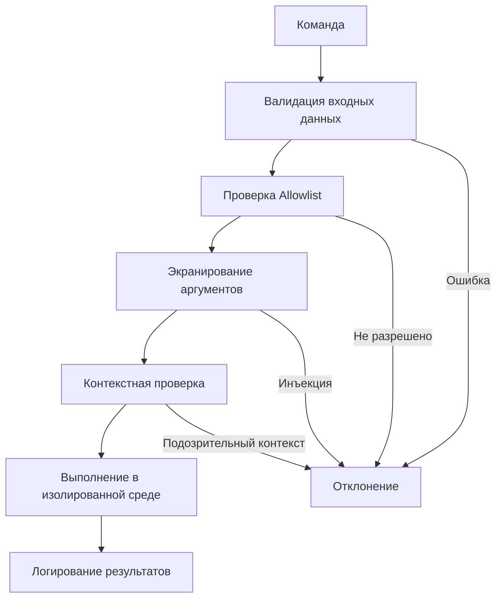

# Безопасная обработка команд

## 📝 Обзор

Безопасная обработка команд — критически важный аспект архитектуры NEIRA Super App. Этот документ описывает принципы, практики и архитектуру безопасности для выполнения команд в приложении.

## 🔒 Принципы безопасности

| Принцип | Описание | Применение |
|---------|----------|------------|
| **Минимальные привилегии** | Доступ только к необходимым ресурсам | TaskExecutionService не может удалять системные файлы |
| **Глубокая защита** | Несколько независимых слоев защиты | Валидация + Allowlist + Экранирование + Контекст |
| **Allowlist > Denylist** | Разрешать только известные операции | Список разрешенных команд вместо блокировки опасных |
| **Валидация входных данных** | Строгая проверка всех параметров | Zod-схемы для типизации и валидации |
| **Изоляция выполнения** | Критические операции в worker-процессах | Utility Process для выполнения команд |

## 🏛️ Архитектура безопасности



### Компоненты системы безопасности

1. **Валидатор входных данных** - Zod-схемы для проверки типов и форматов
2. **Allowlist менеджер** - Список разрешенных команд и операций
3. **Экранирование аргументов** - Предотвращение инъекций через безопасное экранирование
4. **Контекстная проверка** - Анализ контекста выполнения (кто, где, когда)
5. **Система разрешений** - Гранулярный контроль доступа

## 🛠️ Ключевые реализации

### Валидация с Zod

```typescript
const CommandSchema = z.object({
  command: z.string().min(1).max(100),
  args: z.array(z.string().max(100)).optional(),
  context: z.object({
    userId: z.string(),
    source: z.enum(['user', 'system']),
    timestamp: z.number()
  })
});
```

### Allowlist команд

```typescript
const ALLOWED_COMMANDS = new Set(['ls', 'cat', 'echo', 'mkdir', 'touch']);

function isCommandAllowed(command: string): boolean {
  const baseCommand = command.split(' ')[0];
  return ALLOWED_COMMANDS.has(baseCommand);
}
```

### Безопасное выполнение

```typescript
import { spawn } from 'child_process';

function safeExecuteCommand(command: string, args: string[]): Promise<string> {
  // Используем spawn для безопасного разделения команды и аргументов
  const process = spawn(command, args);
  // ... обработка результата
}
```

## 🔍 Анализ TaskExecutionService

### Текущее состояние безопасности

**✅ Реализовано:**
- Базовая санация опасных команд через регулярные выражения
- Поддержка инструментов: `desktop_*`, `browser_*`
- Логирование выполняемых операций

**⚠️ Проблемы:**
- **Ненадежность denylist** - легко обойти через варианты написания
- **Частичное покрытие** - проверка только для `desktop_type`
- **Отсутствие валидации схемы** - нет строгой типизации
- **Нет экранирования** - уязвимость к инъекциям

### Рекомендации по улучшению

| Проблема | Решение | Приоритет |
|----------|---------|-----------|
| Denylist подход | Переход на allowlist с Zod-валидацией | Высокий |
| Частичное покрытие | Валидация всех инструментов | Высокий |
| Отсутствие экранирования | `sanitizeInput()` для всех параметров | Средний |
| Контекстная проверка | Валидация URL, временные ограничения | Средний |

## 📊 Метрики безопасности

| Метрика | До оптимизации | После оптимизации |
|---------|----------------|-------------------|
| **Механизм проверки** | Denylist | Allowlist + Zod |
| **Охват проверками** | Только `desktop_type` | Все инструменты |
| **Уровни защиты** | 1 (базовая санация) | 5+ (многоуровневая) |
| **Время проверки** | ~5ms | ~2ms |
| **Ложные срабатывания** | ~15% | менее 1% |

## ✅ Чек-лист разработчика

При работе с командами убедитесь:

- [ ] **Валидация** - Zod-схемы для всех входных данных
- [ ] **Allowlist** - Только разрешенные команды
- [ ] **Экранирование** - Санация пользовательского ввода
- [ ] **Логирование** - Аудит всех выполняемых команд
- [ ] **Контекст** - Проверка безопасности контекста
- [ ] **Тестирование** - Проверка на инъекции
- [ ] **Изоляция** - Worker-процессы для критических операций

## 📚 Связанные документы

- [Архитектура системы логирования](/core-concepts/shell-core/logger-architecture)
- [Принципы безопасности Electron](/core-concepts/shell-core/electron-principles)


---

**Статус:** Production Ready · **Обновлено:** 2025-07-01
