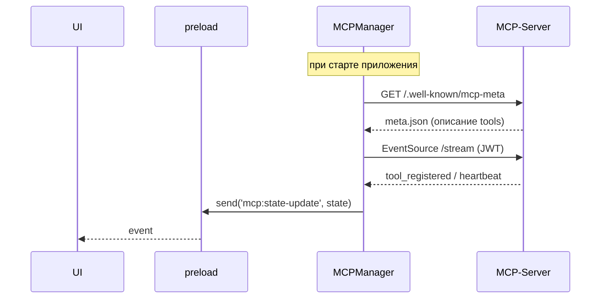
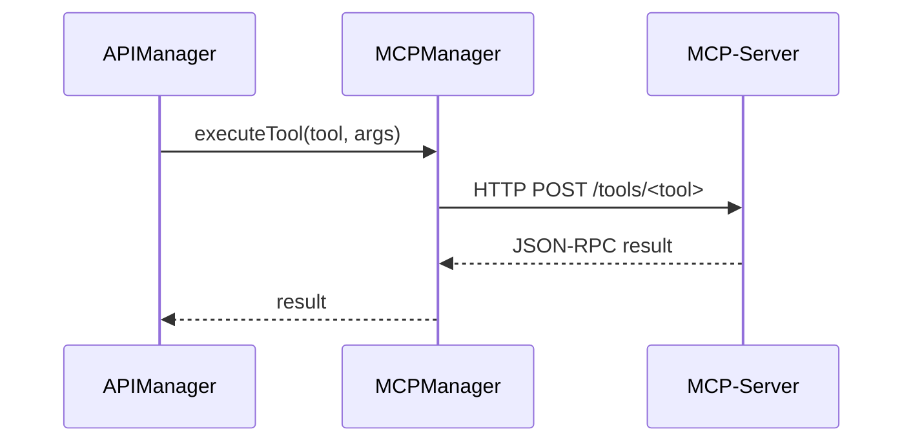

# 🛰️ MCP Architecture & Integration

**Версия:** 2025-07-02 **Статус:** ✅ Canonical

Документ объединяет и обобщает материалы из исторических файлов `13-mcp-protocol.md` и `19-mcp-integration.md`, а также актуальные практики, внедрённые после релиза v0.3.1.

---

## 1. Что такое MCP?

**Model Control Protocol (MCP)** — это JSON-RPC-поверх-EventSource протокол, позволяющий NEIRA Super App вызывать «инструменты» (tools), размещённые на внешних серверах/процессах. MCP выступает «руками и ушами» LLM-агентов, расширяя их возможностями файловой системы, браузера, нативных API и т. д.

• Формат сообщений — JSON-RPC 2.0.  
• Транспорт — Server-Sent Events (EventSource) + HTTP POST для вызовов.  
• Аутентификация — HMAC-SHA256 сигнатура заголовка `x-neira-signature`.

---

## 2. Ключевые компоненты

| Компонент            | Где находится                                    | Ответственность                                                |
| -------------------- | ------------------------------------------------ | -------------------------------------------------------------- |
| `MCPManager`         | `packages/shell/src/main/managers/MCPManager.ts` | Управление списком MCP-серверов, health-checks, ключи доступа. |
| `ProcessManager`     | shell                                            | Запускает Embedded MCP-workers (для локальных процессов).      |
| `IPC • mcp:*`        | preload → renderer                               | Передаёт UI-события (`mcp:state-update`, `mcp:error`).         |
| `useMCPPassiveStore` | `features/mcp/hooks`                             | «Зеркало» состояния на стороне UI (Zustand, read-only).        |

---

## 3. Жизненный цикл подключения

_Failure Handling_: если EventSource падает → автоматический `exponentialBackoffReconnect()` с макс. 5 мин.

---

## 4. IPC Каналы

| Channel            | Direction                      | Payload               | Описание                                     |
| ------------------ | ------------------------------ | --------------------- | -------------------------------------------- |
| `mcp:list`         | UI → shell (`invoke`)          | —                     | Получить список сконфигурированных серверов. |
| `mcp:addServer`    | UI → shell                     | `{ url }`             | Добавить сервер в конфиг.                    |
| `mcp:removeServer` | UI → shell                     | `{ id }`              | Удалить.                                     |
| `mcp:executeTool`  | shell → MCP-server (HTTP POST) | `{ tool, args }`      | Вызывается из `APIManager` при tool call.    |
| `mcp:state-update` | shell → UI (`send`)            | `{ servers, status }` | Push-уведомление об изменении состояния.     |

Полный контракт находится в `packages/shared-types/src/mcp-contracts.ts`.

---

## 5. Взаимодействие MCPManager ⇄ APIManager

Когда LLM присылает `tool_calls`, `APIManager` делает `invoke('mcp:executeTool', …)`:

Timeout по умолчанию — 30 сек. При превышении отправляется IPC-событие `mcp:error` в UI с подробностями.

---

## 6. Безопасность

1. **CORS**: MCP-серверы обязаны отвечать `Access-Control-Allow-Origin: neira://app`.
2. **HMAC-SHA256**: Каждый запрос подписывается ключом, хранимым в **Keychain**/Keytar.
3. **Sandbox**: MCP-worker запускаются в отдельном utility process (Electron `sandbox: true`).

---

## 7. Troubleshooting

| Симптом                                                | Возможная причина           | Проверка                                         |
| ------------------------------------------------------ | --------------------------- | ------------------------------------------------ |
| `mcp:state-update` приходит с `status: "disconnected"` | EventSource закрыт сервером | Логи MCPManager `close code` + reason            |
| `executeTool` = timeout                                | Сервер не ответил за 30 сек | Попробовать `curl -v` ручками, проверить latency |
| UI «моргает» при большом количестве событий            | Заливается IPC              | Убедиться, что `throttleStateUpdates()` активен  |

---

## 8. Revision History

| Дата       | Версия | Автор      | Изменение                                                      |
| ---------- | ------ | ---------- | -------------------------------------------------------------- |
| 2025-07-02 | 2.0    | @docs-team | Полное наполнение, добавлены секции security & troubleshooting |
