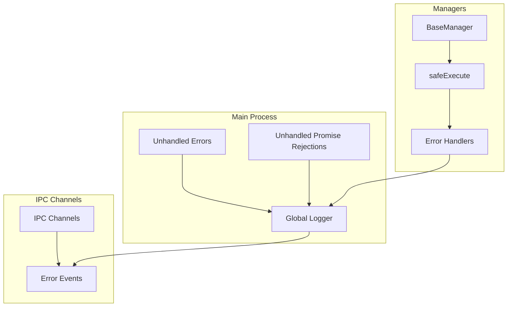

# 🛡️ Error Handling & Stability

**Версия:** 2025-08-05 **Статус:** ✅ Canonical

Система обработки ошибок и обеспечения стабильности в NEIRA Super App Shell.

---

## 1. Философия обработки ошибок

1. **Fail-safe принцип** — система должна продолжать работу даже при частичных сбоях
2. **Transparent errors** — все ошибки логируются с полным stack trace
3. **Graceful degradation** — при сбое компонента система переключается в безопасный режим
4. **Proactive monitoring** — предотвращение ошибок через валидацию и проверки

---

## 2. Архитектура обработки ошибок



---

## 3. Глобальная обработка ошибок

### 3.1 Main Process Error Handlers

**Расположение:** `packages/shell/src/main/index.ts`

```typescript
// Глобальная обработка необработанных Promise rejections
process.on('unhandledRejection', (reason, promise) => {
  logger.error('❌ Unhandled Promise Rejection:', reason)
  logger.error('Promise:', promise)
  if (reason instanceof Error) {
    logger.error('Stack:', reason.stack)
  }
})

// Глобальная обработка необработанных исключений
process.on('uncaughtException', (error) => {
  logger.error('❌ Uncaught Exception:', error.message)
  logger.error('Stack:', error.stack)
  // Graceful shutdown
  process.exit(1)
})
```

### 3.2 BaseManager Safe Execution

Все менеджеры наследуются от `BaseManager` и используют `safeExecute`:

```typescript
class BaseManager {
  protected async safeExecute<T>(
    operation: () => Promise<T>,
    context: string
  ): Promise`<T | null>` {
    try {
      return await operation()
    } catch (error) {
      this.logger.error(`[${context}] Operation failed:`, error)
      return null
    }
  }
}
```

---

## 4. Критические исправления стабильности

### 4.1 Унификация обработки ошибок (STABILITY:CRITICAL_FIXES_2025_07)

**Проблема:** Множественные критические уязвимости приводили к крэшам: UnhandledPromiseRejection в main-процессе, двойной запуск PythonAPIManager, потеря истории чатов, некорректный статус голосового ввода, дублирование allowed-channels.json.

**Решение:**

- Добавлен глобальный обработчик `process.on('unhandledRejection')` с логированием stack trace
- Удален вызов `startPythonAgent()` из конструктора PythonAPIManager для предотвращения двойного запуска
- Переписана логика `useEffect` в useChatState.ts для корректного переиспользования `storeChatId`
- Метод `getStatus()` в AudioManager всегда возвращает поля `voiceMode` и `settings`
- Плагин `copy-preload-files` копирует единый `allowed-channels.json` из `src/main/preload`

**Результат:** Приложение инициализируется без фатальных ошибок, Python-бэкенд запускается корректно один раз, история чатов сохраняется между сообщениями, голосовой ввод отображает корректный статус, единый источник истины для IPC-каналов.

---

## 5. Специфические обработчики ошибок

### 5.1 Python API Manager

```typescript
class PythonAPIManager extends BaseManager {
  async startPythonAgent(): Promise<void> {
    return this.safeExecute(async () => {
      // Проверка доступности Python
      await this.checkPythonAvailability()
      
      // Запуск агента только если не запущен
      if (!this.isAgentRunning()) {
        await this.spawnPythonProcess()
      }
    }, 'startPythonAgent')
  }
  
  private handlePythonError(error: Error): void {
    this.logger.error('Python Agent error:', error)
    // Переключение в mock-режим при критических ошибках
    this.switchToMockMode()
  }
}
```

### 5.2 IPC Error Handling

```typescript
// Универсальный обработчик IPC ошибок
ipcMain.handle('channel-name', async (event, ...args) => {
  try {
    return await this.handleRequest(...args)
  } catch (error) {
    this.logger.error(`IPC [channel-name] error:`, error)
    
    // Отправка ошибки в UI для user-friendly сообщения
    event.sender.send('error-notification', {
      message: 'Operation failed',
      technical: error.message
    })
    
    throw error // Re-throw для proper Promise rejection
  }
})
```

---

## 6. Error Recovery Strategies

### 6.1 Менеджеры с автовосстановлением

| Менеджер | Стратегия восстановления | Timeout |
|----------|-------------------------|---------|
| PythonAPIManager | Mock-режим → Retry | 30s |
| WindowManager | Перезапуск окна | 5s |
| TabManager | Создание нового таба | N/A |
| AudioManager | Сброс к настройкам по умолчанию | 10s |

### 6.2 Health Checks

```typescript
class HealthCheckManager extends BaseManager {
  async performHealthCheck(): Promise<HealthStatus> {
    const checks = await Promise.allSettled([
      this.checkPythonAPI(),
      this.checkFileSystem(),
      this.checkMemoryUsage(),
      this.checkDiskSpace()
    ])
    
    return {
      overall: checks.every(c => c.status === 'fulfilled') ? 'healthy' : 'degraded',
      details: checks
    }
  }
}
```

---

## 7. Мониторинг и метрики

### 7.1 Автоматическое уведомление об ошибках

```typescript
class ErrorReporter {
  private errorCount = new Map<string, number>()
  
  reportError(error: Error, context: string): void {
    const key = `${context}:${error.name}`
    const count = (this.errorCount.get(key) || 0) + 1
    this.errorCount.set(key, count)
    
    // Уведомление при превышении порога
    if (count > 5) {
      this.notifyDevelopers({
        error: error.message,
        context,
        frequency: count
      })
    }
  }
}
```

### 7.2 Crash Reports

Автоматическое создание crash reports в `logs/crashes/`:

```
crash-2025-08-05-14-30-15.json
{
  "timestamp": "2025-08-05T14:30:15.123Z",
  "error": "TypeError: Cannot read property...",
  "stack": "...",
  "context": "PythonAPIManager.startAgent",
  "systemInfo": { ... },
  "lastActions": [ ... ]
}
```

---

## 8. Лучшие практики

### 8.1 Do's

- ✅ Всегда логируйте stack trace
- ✅ Используйте типизированные ошибки  
- ✅ Обеспечивайте graceful degradation
- ✅ Валидируйте входные данные

### 8.2 Don'ts

- ❌ Никогда не подавляйте ошибки молча
- ❌ Не используйте catch-all без логирования
- ❌ Не блокируйте UI при обработке ошибок
- ❌ Не показывайте technical details пользователю

---

_Документ интегрирует знания из критических исправлений стабильности (июль 2025)_
