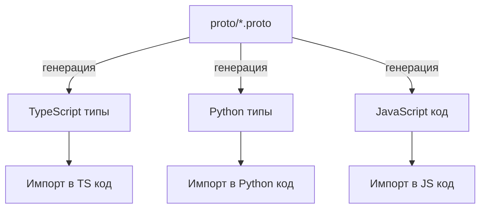

# Proto-контракты: Единый источник правды

## Метаданные

- **Статус:** Актуально
- **Версия:** 1.0.0
- **Дата создания:** 2025-08-04
- **Авторы:** DocBuilder AI Assistant

## Обзор

Proto-контракты в NEIRA Super App используются как единый источник правды (SSOT) для типизированного взаимодействия между компонентами системы. Они обеспечивают согласованность API, безопасность и типобезопасность при обмене данными.

## Ключевые proto-файлы

| Файл | Назначение | Используется в |
|------|------------|----------------|
| `proto/agent.proto` | Контракт для AI-агентов | Python API, gRPC сервер |
| `proto/chrome-extensions.proto` | Формат CRX и взаимодействие с Chrome Web Store | electron-chrome-web-store |

## Принципы работы с proto

### Единый источник правды

1. **Все определения** находятся только в директории `proto/`
2. **Никогда не редактируйте** сгенерированные файлы
3. **Все изменения API** должны начинаться с изменения proto-файлов



### Процесс обновления proto-файлов

1. **Изменение proto-файла** в директории `proto/`
2. **Генерация кода** с помощью соответствующей команды
3. **Импорт сгенерированных типов** в код вместо ручного определения

## Генерация кода

### Общая команда для всех proto-файлов

```bash
# Генерация всех proto-файлов
yarn proto:gen
```

### Для конкретных proto-файлов

```bash
# Только для Chrome Extensions
yarn proto:gen:chrome-extensions

# Только для Agent API
yarn proto:gen:agent
```

## Структура сгенерированных файлов

| Proto-файл | Выходные файлы | Импорт в коде |
|------------|----------------|---------------|
| chrome-extensions.proto | `packages/electron-chrome-web-store/src/browser/generated/chrome-extensions_pb.js` | `import { CrxFile } from '../../browser/crx3'` |
| agent.proto | `packages/polylith-backend/src/generated/agent_pb.ts` | `import { AgentRequest } from '../generated/agent_pb'` |

## Лучшие практики

### 1. Обратная совместимость

- **Добавляйте новые поля**, но не удаляйте существующие
- **Используйте optional** для новых полей
- **Сохраняйте нумерацию полей**

```protobuf
// ✅ Правильно: добавление нового поля
message UserProfile {
  string name = 1;
  int32 age = 2;
  optional string avatar_url = 3; // Новое поле
}

// ❌ Неправильно: изменение нумерации
message UserProfile {
  string name = 2; // Было 1
  int32 age = 1;   // Было 2
}
```

### 2. Именование

- **CamelCase** для сообщений и сервисов
- **snake_case** для полей и методов
- **Единообразные суффиксы** (Request/Response/Event)

```protobuf
// ✅ Правильно: соблюдение конвенций
message SearchRequest {
  string query_text = 1;
  int32 page_number = 2;
}

// ❌ Неправильно: смешение стилей
message searchrequest {
  string QueryText = 1;
  int32 pageNumber = 2;
}
```

### 3. Документирование

- **Комментируйте все сообщения и поля**
- **Указывайте единицы измерения** для числовых полей
- **Документируйте значения по умолчанию**

```protobuf
// SearchRequest представляет запрос поиска
message SearchRequest {
  // Текст запроса поиска
  string query_text = 1;
  
  // Номер страницы результатов (начиная с 0)
  int32 page_number = 2;
  
  // Размер страницы (по умолчанию 10)
  int32 results_per_page = 3;
}
```

## Примеры использования

### Импорт в TypeScript

```typescript
// Импорт типов из сгенерированных файлов
import { AgentRequest, AgentResponse } from '../generated/agent_pb';

// Использование типов
function processAgentRequest(request: AgentRequest): AgentResponse {
  const response = new AgentResponse();
  // ...
  return response;
}
```

### Импорт в Python

```python
# Импорт типов из сгенерированных файлов
from generated.agent_pb2 import AgentRequest, AgentResponse

# Использование типов
def process_agent_request(request: AgentRequest) -> AgentResponse:
    response = AgentResponse()
    # ...
    return response
```

## Кросс-языковая совместимость

### Проблемы совместимости

| Проблема | Решение |
|----------|---------|
| Разные соглашения об именовании | Адаптеры для преобразования имен |
| Разные типы данных | Использование базовых типов Protocol Buffers |
| Разная сериализация | Использование protobuf для всех языков |

### Адаптер для JavaScript/Python

```typescript
// Адаптер для преобразования snake_case в camelCase
function adaptMethodName(pythonName: string): string {
  return pythonName.replace(/_([a-z])/g, (_, letter) => letter.toUpperCase());
}

// Использование
const jsMethodName = adaptMethodName('execute_command'); // executeCommand
```

## Мониторинг и отладка

### Логирование proto-сообщений

```typescript
// Безопасное логирование proto-сообщений
function logProtoMessage(message: any, type: string): void {
  logger.debug(`${type} message:`, {
    type: message.constructor.name,
    // Преобразование в обычный объект для логирования
    data: message.toObject()
  });
}
```

### Валидация сообщений

```typescript
// Валидация сообщений перед отправкой
function validateProtoMessage(message: any): boolean {
  try {
    // Проверка обязательных полей
    const bytes = message.serializeBinary();
    // Попытка десериализации для проверки
    message.constructor.deserializeBinary(bytes);
    return true;
  } catch (error) {
    logger.error('Invalid proto message:', error);
    return false;
  }
}
```

## Связанные документы

- [Архитектура системы](/core-concepts/architecture-patterns/system-overview)
- [Интеграция с Chrome Web Store](/core-concepts/shell-core/chrome-web-store-integration)
- [Python API интеграция](/core-concepts/ai-engine/python-integration)

---

**Верификация документа**

- **Дата создания:** 2025-08-04
- **Создал:** DocBuilder AI Assistant
- **Источник:** Анализ proto-файлов и их использования в проекте
- **Проверка актуальности:** Документ отражает текущее состояние кода на 04.08.2025
