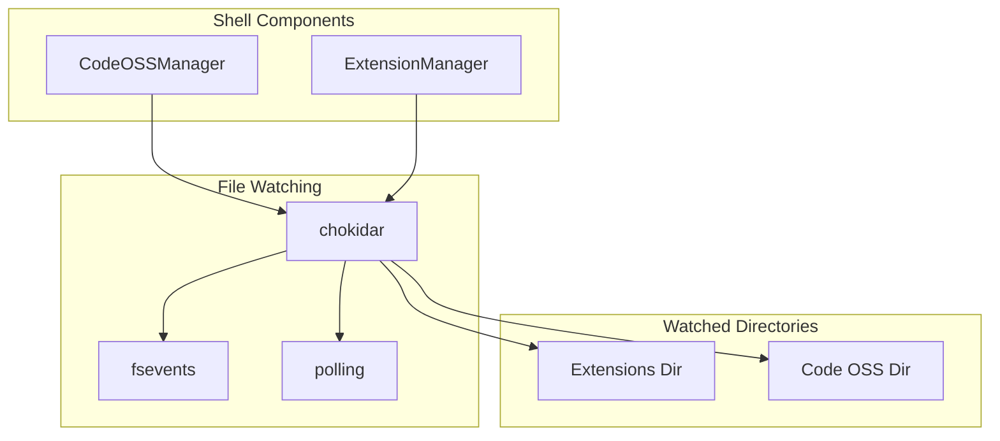

# 👁️ File Watching System Architecture

**Версия:** 2025-06-30 **Статус:** ✅ Canonical

Система отслеживания файлов в NEIRA Super App обеспечивает мониторинг изменений в файловой системе для различных компонентов, включая расширения Chrome и Code OSS.

---

## 1. Архитектура



---

## 2. Ключевые компоненты

### 2.1 CodeOSSManager File Watching

**Расположение:** `packages/shell/src/main/managers/CodeOSSManager.ts`

Отслеживает изменения в директории расширений для автоматической перезагрузки.

### 2.2 Конфигурация chokidar

```typescript
this.extensionsWatcher = chokidar.watch(this.extensionsDir, {
  depth: 1,
  ignoreInitial: true,
  persistent: true,
  usePolling: false,
  useFsEvents: false, // Отключено из-за проблем на macOS
  atomic: true,
})
```

---

## 3. Решенные проблемы

### 3.1 fsevents SinceNow Error на macOS (SHELL:FSEVENTS_MACOS_ERROR_FIX)

**Проблема:** Ошибка `Cannot read properties of undefined (reading 'SinceNow')` в fsevents на macOS при отслеживании файлов через chokidar.

**Решение:** Отключен `useFsEvents: false` в chokidar.watch для CodeOSSManager с комментарием о проблеме.

**Результат:** Устранены crashes на macOS, система переключилась на polling для отслеживания файлов.

**Альтернативные решения:**

1. Обновление chokidar и fsevents до более новых версий
2. Использование другого механизма отслеживания файлов на macOS  
3. Добавление обработки ошибок для fsevents с автоматическим переключением на polling при сбоях

---

## 4. Производительность

### 4.1 Polling vs fsevents

| Метод | Производительность | Совместимость | Использование |
|-------|-------------------|---------------|---------------|
| fsevents | Высокая | macOS только | Отключено из-за ошибок |
| polling | Средняя | Все ОС | Текущий метод |
| inotify | Высокая | Linux | Автоматически |

### 4.2 Оптимизация

- `depth: 1` — ограничение глубины сканирования
- `ignoreInitial: true` — игнорирование существующих файлов при запуске
- `atomic: true` — ожидание завершения записи файла

---

## 5. Мониторинг и отладка

### 5.1 Логирование событий

```typescript
this.extensionsWatcher
  .on('add', path => this.logger.info(`File added: ${path}`))
  .on('change', path => this.logger.info(`File changed: ${path}`))
  .on('unlink', path => this.logger.info(`File removed: ${path}`))
  .on('error', error => this.logger.error(`Watcher error: ${error}`))
```

### 5.2 Диагностика проблем

1. **Высокое CPU** — проверить `usePolling` и `interval`
2. **Пропущенные события** — проверить `atomic` и `awaitWriteFinish`
3. **Ошибки на macOS** — проверить `useFsEvents: false`

---

## Revision History

| Date | Version | Change | Author |
|------|---------|--------|--------|
| 2025-06-30 | 1.0 | Создание документа, интеграция fsevents fix | @docbuilder |
