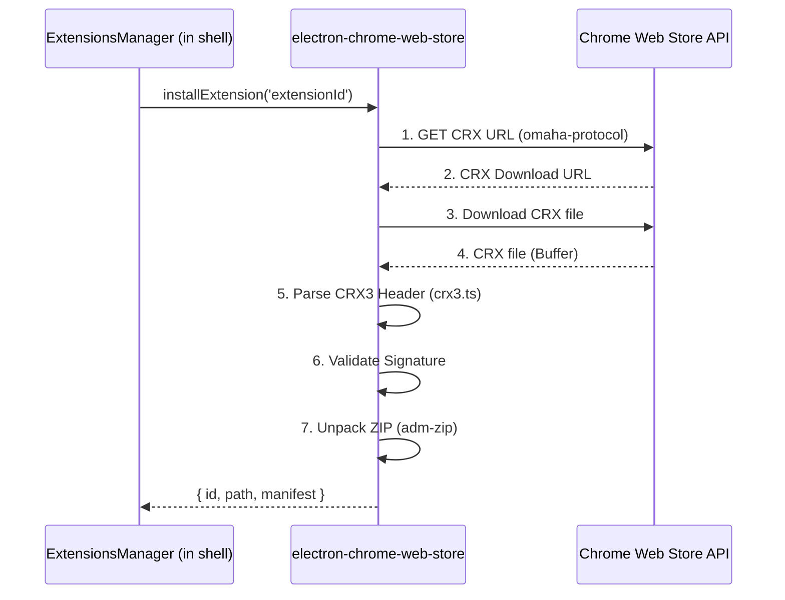

# Архитектура: Интеграция с Chrome Web Store

## Метаданные

- **Статус:** Актуально
- **Версия:** 1.0
- **Дата обновления:** 2025-08-02
- **Авторы:** DocBuilder
- **Связанные компоненты:** `electron-chrome-web-store`, `ExtensionsManager`

## Введение

Пакет `electron-chrome-web-store` является ключевым компонентом для интеграции NEIRA Super App с экосистемой расширений Chrome. Он обеспечивает безопасную и надежную установку, обновление и управление расширениями из официального Chrome Web Store.

## Философия и принципы

### Security First

Безопасность является главным приоритетом при работе с расширениями Chrome:

- **Строгая валидация:** Каждый CRX3-файл проходит полную валидацию заголовков и подписей
- **Изоляция исполнения:** Пакет никогда не исполняет код из расширений, а только распаковывает файлы
- **Контроль доступа:** Поддержка белых и черных списков расширений для ограничения установки

### Service, Not a Manager

Пакет спроектирован как сервис без состояния:

- **Атомарные операции:** Каждая функция (`install`, `update`, `uninstall`) выполняет одну конкретную задачу
- **Отсутствие состояния:** Пакет не хранит информацию об установленных расширениях
- **Чистый API:** Экспортируются только асинхронные функции без классов с глобальным состоянием

### Clear Separation of Concerns

Четкое разделение ответственности между компонентами:

- **`electron-chrome-web-store`:** Скачивает, валидирует, распаковывает, обновляет
- **`electron-chrome-extensions`:** Запускает, эмулирует Chrome API, управляет жизненным циклом
- **`shell` (`ExtensionsManager`):** Оркестрирует оба пакета, решает, что и когда устанавливать/запускать

## Архитектура

### Компоненты пакета

```
packages/electron-chrome-web-store/
├── src/
│   ├── browser/
│   │   ├── crx3.ts             # Парсинг и валидация CRX3 формата
│   │   ├── downloader.ts       # Загрузка расширений из Chrome Web Store
│   │   ├── installer.ts        # Установка и обновление расширений
│   │   └── omaha-client.ts     # Клиент для протокола Omaha (обновления)
│   ├── common/
│   │   └── utils.ts            # Общие утилиты
│   ├── renderer/
│   │   └── api.ts              # API для renderer процесса
│   └── types/
│       └── index.ts            # TypeScript типы
└── index.ts                    # Точка входа в пакет
```

### Жизненный цикл установки расширения



## Взаимодействие с другими компонентами

### ExtensionsManager

`ExtensionsManager` в пакете `shell` является основным оркестратором, который использует `electron-chrome-web-store` для установки и обновления расширений:

```typescript
// Пример взаимодействия ExtensionsManager с electron-chrome-web-store
import { installExtension } from 'electron-chrome-web-store';

class ExtensionsManager extends BaseManager {
  async installExtensionFromWebStore(extensionId: string) {
    try {
      const result = await installExtension(extensionId, {
        extensionsPath: this.extensionsPath,
        allowlist: this.allowlist,
      });
      
      // После успешной установки зарегистрировать расширение
      this.registerExtension(result);
      return result;
    } catch (error) {
      this.logger.error(`Failed to install extension ${extensionId}:`, error);
      throw error;
    }
  }
}
```

### electron-chrome-extensions

После установки расширения с помощью `electron-chrome-web-store`, `electron-chrome-extensions` берет на себя задачу запуска и управления жизненным циклом расширения:

```typescript
// Пример взаимодействия с electron-chrome-extensions
import { ExtensionsBrowserAction } from 'electron-chrome-extensions';

// После установки расширения
const extension = await this.installExtensionFromWebStore(extensionId);
this.extensionsAPI.loadExtension(extension.path);
```

## Работа с форматом CRX3

### Структура CRX3 файла

CRX3 — это формат упаковки расширений Chrome, который включает:

1. Заголовок CRX3 с метаданными и подписями
2. ZIP-архив с файлами расширения

```
+-------------------------+
| CRX3 Header             |
| - Magic Number ("Cr24") |
| - Version (3)           |
| - Header Size           |
| - Signatures            |
+-------------------------+
| ZIP Archive             |
| - manifest.json         |
| - background.js         |
| - content_scripts/      |
| - ...                   |
+-------------------------+
```

### Парсинг и валидация

Пакет использует Protocol Buffers для работы с бинарным форматом CRX3:

```typescript
// Пример парсинга CRX3 заголовка
import { parseCrx3Header } from './crx3';

async function validateCrxFile(buffer: Buffer) {
  // Парсинг заголовка
  const header = parseCrx3Header(buffer);
  
  // Валидация подписи
  const isValid = await validateSignature(header, buffer);
  
  if (!isValid) {
    throw new Error('Invalid CRX signature');
  }
  
  // Извлечение ZIP-архива
  const zipStartOffset = 16 + header.headerSize;
  const zipBuffer = buffer.slice(zipStartOffset);
  
  return { header, zipBuffer };
}
```

## Протокол Omaha

Протокол Omaha используется для взаимодействия с Chrome Web Store API и получения информации о расширениях:

```typescript
// Пример запроса к Omaha API
async function getExtensionUpdateUrl(extensionId: string): Promise<string> {
  const response = await fetch('https://update.googleapis.com/service/update2/json', {
    method: 'POST',
    body: JSON.stringify({
      request: {
        protocol: '3.1',
        prodversion: '100.0.4896.127',
        acceptformat: 'crx3',
        app: [{
          appid: extensionId,
          updatecheck: {},
        }],
      },
    }),
  });
  
  const data = await response.json();
  return data.response.app[0].updatecheck.urls.url[0].codebase;
}
```

## Лучшие практики

1. **Всегда используйте allowlist** для контроля устанавливаемых расширений
2. **Регулярно обновляйте расширения** для получения исправлений безопасности
3. **Обрабатывайте ошибки установки** и предоставляйте понятную обратную связь
4. **Не модифицируйте файлы расширений** после установки
5. **Следуйте принципу минимальных привилегий** при настройке разрешений для расширений

## Отладка и диагностика

### Общие проблемы и решения

| Проблема | Возможная причина | Решение |
|----------|-------------------|---------|
| Ошибка загрузки CRX | Сетевая проблема или неверный ID | Проверьте доступность Chrome Web Store и корректность ID расширения |
| Ошибка валидации подписи | Поврежденный файл или несовместимая версия | Убедитесь, что расширение совместимо с текущей версией Chrome |
| Ошибка распаковки | Поврежденный ZIP или проблемы с правами доступа | Проверьте права доступа к директории установки |

### Логирование

Для отладки проблем используйте детальное логирование:

```typescript
import { installExtension } from 'electron-chrome-web-store';

// Включение детального логирования
process.env.ELECTRON_CHROME_WEBSTORE_DEBUG = '1';

try {
  await installExtension('extension-id');
} catch (error) {
  console.error('Installation failed:', error);
}
```

## Заключение

Пакет `electron-chrome-web-store` предоставляет надежный и безопасный способ интеграции с экосистемой расширений Chrome. Следуя описанным принципам и практикам, вы можете эффективно использовать его для расширения функциональности NEIRA Super App.

## Связанные ресурсы

- [Руководство по установке расширений](/how-to-guides/installing-chrome-extensions)
- [Справочник по Chrome Extensions API](/reference/chrome-extensions)
- [Техническая документация по CRX3 Parser](/reference/crx3-parser-guide)
