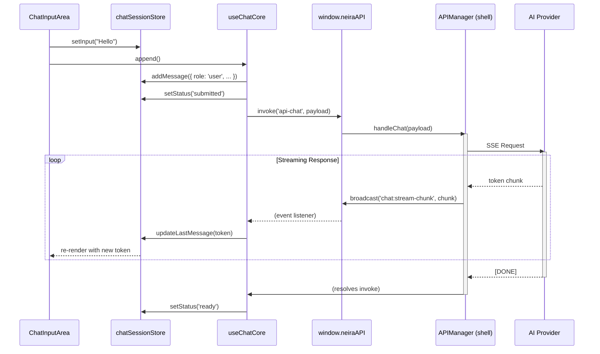

# ��️ Chat Architecture

**Версия:** 2025-07-03 **Статус:** ✅ Canonical

Этот документ — единственный источник правды по архитектуре чата в `neira-app`. Он описывает состояние после рефакторинга _Daebak 2.0_, который унифицировал управление состоянием через `Zustand` и `React Query`.

---

## 1. Философия и разделение состояний

Архитектура чата следует принципу **SSOT (Single Source of Truth)** для каждого типа данных, чтобы избежать десинхронизации и "гонки состояний".

1. **`chatSessionStore` (Zustand) — источник правды для UI.**

    - **Отвечает за:** текущие сообщения в сессии, статус (`loading`, `streaming`), содержимое поля ввода (`input`), ошибки.
    - **Жизненный цикл:** Состояние создается при входе в чат и очищается при выходе. Это эфемерное состояние, живущее только во время активной сессии.
    - **Почему Zustand?** Идеален для часто обновляемого, синхронного UI-состояния. `Immer`-мидлвара обеспечивает иммутабельные обновления.

2. **React Query — кэш для серверных данных.**

    - **Отвечает за:** список чатов пользователя (`['chats', userId]`) и историю сообщений конкретного чата (`['chat', chatId]`).
    - **Жизненный цикл:** Данные запрашиваются через IPC, кэшируются и автоматически инвалидируются, обеспечивая консистентность с `shell`.
    - **Почему React Query?** Управляет асинхронными операциями (загрузка, ошибки), фоновой синхронизацией и оптимистичными обновлениями.

3. **Компоненты — «глупые» и декларативные.**
    - UI-компоненты (`Chat`, `MessageList`, `ChatInputArea`) **не содержат собственной логики состояния**.
    - Они подписываются напрямую на `useChatSessionStore` и получают все необходимые данные и экшены. Проп-дриллинг сведен к минимуму.

---

## 2. Поток данных: от ввода до отрисовки токена

Ключевой сценарий — отправка сообщения и получение потокового ответа.



**Ключевые моменты:**

- **Оптимистичное обновление:** Сообщение пользователя добавляется в `chatSessionStore` _до_ отправки запроса на сервер.
- **Однонаправленный поток:** UI вызывает экшены, `useChatCore` оркестрирует IPC, `APIManager` работает с AI, события стриминга летят обратно и обновляют стор, что вызывает ре-рендер UI.
- **Декомпозиция:** `useChatCore` не занимается напрямую подписками на стриминг. Эту логику инкапсулирует хук `useChatStreaming`, который вызывается внутри `useChatCore`.

---

## 3. Ключевые хуки и их зоны ответственности

| Хук                   | Зона ответственности                                                                             | Основные зависимости                                        |
| --------------------- | ------------------------------------------------------------------------------------------------ | ----------------------------------------------------------- |
| `useChatCore`         | **Оркестратор.** Собирает все части вместе, управляет `append`, обрабатывает результат IPC.      | `useChatSessionStore`, `useChatSession`, `useChatStreaming` |
| `useChatSessionStore` | **Состояние сессии (Zustand).** Хранит сообщения, статус, input. Предоставляет экшены.           | `zustand`, `immer`                                          |
| `useChatSession`      | **Кэш истории (React Query).** Загружает и кэширует историю сообщений для `chatId`.              | `@tanstack/react-query`                                     |
| `useChatStreaming`    | **Подписчик на IPC.** Слушает `chat:stream-chunk` и вызывает экшены стора (`updateLastMessage`). | `window.neiraAPI`                                           |
| `useChatState`        | **Состояние UI-контейнера.** Управляет ID чата, синхронизируя URL и стор.                        | `useChatUIStore`                                            |

---

## 4. Антипаттерны и лучшие практики

| ❌ Плохо (старый подход)                                 | ✅ Хорошо (Daebak 2.0)                                          | Причина                         |
| -------------------------------------------------------- | --------------------------------------------------------------- | ------------------------------- |
| `useState` для сообщений в компоненте                    | `useChatSessionStore((s) => s.messages)`                        | Централизованное состояние      |
| Прокидывание `messages`, `setMessages` через пропсы      | Прямая подписка компонентов на стор                             | Устранение проп-дриллинга       |
| `useEffect` для подписки на IPC в `useChatCore`          | Вызов хука `useChatStreaming`                                   | Инкапсуляция и SRP              |
| Хранение `input` в `useState` компонента `ChatInputArea` | `useChatSessionStore((s) => s.input)`                           | Единый контролируемый input     |
| Ручное обновление кэша React Query                       | `queryClient.invalidateQueries({ queryKey: ['chat', chatId] })` | Декларативный и надежный подход |

---

## 5. Решенные проблемы и рефакторинги (Daebak 2.0)

В процессе эволюции чат-архитектуры было выявлено и исправлено несколько критических проблем:

### 5.1 Проблемы реактивности (CHAT:REACTIVITY_OPTIMIZATION)

**Проблема:** Новые сообщения и стриминговые данные не отображались мгновенно из-за неправильной реактивности в `chatSessionStore.ts`.

**Решение:**

- Переписаны методы `addMessage` и `updateLastMessage` для создания новых массивов `newMessages` (гарантия новой ссылки для React)
- Временно удален `React.memo` из `Message.tsx` для устранения блокировки перерисовки
- Удалены неиспользуемые импорты `memo` и `fast-deep-equal`

**Результат:** Мгновенное отображение новых сообщений и стриминговых данных, прохождение всех тестов чата.

### 5.2 Виртуализация и перекрывающиеся сообщения (CHAT:VIRTUALIZATION_STABILITY)

**Проблема:** Сообщения в чате визуально накладывались друг на друга из-за постоянной регенерации `chatId` и сброса состояния чата, что ломало виртуализацию `react-window` (кеш высот строк становился невалидным).

**Решение:**

- Стабилизировано состояние чата через `setClientOnlyId(null)` при переключении чатов
- Обеспечена генерация id ровно один раз за сессию и переиспользование store id на корневой странице
- Добавлена `ClientOnly` обёртка для устранения SSR/CSR несоответствий

**Результат:** Виртуальный список получает консистентные ключи и высоты, устранены наложения сообщений и предупреждения о гидратации.

### 5.3 Дублирование блоков Reasoning (CHAT:REASONING_DUPLICATION_FIX)

**Проблема:** Каждый `thought`-чанк создавал новый блок «Reasoning», появлялось несколько одинаковых панелей.

**Решение:**

- Обновлена логика `useChatStreaming.ts` для поиска существующего reasoning-блока
- Исправлена `updateLastMessage` — убран ненадежный детектор `isFinalChunk`
- UI-улучшения: выравнивание сообщений, видимый индикатор «Thinking…»

**Результат:** Один блок «Reasoning» с накапливающимися деталями, корректный стриминг токенов.

### 5.4 Исправление рассинхронизации Chat ID (CHAT:ID_SYNC_FIX)

**Проблема:** При отправке первого сообщения UI генерировал временный ID (`temp-xyz...`), но backend создавал постоянный ID в БД. UI не получал обновленный ID, что приводило к "пропаданию" чатов при перезагрузке.

**Решение:**

- Реализован механизм `setPermanentChatId` в `chatSessionStore` для обновления временного ID на постоянный
- Логика обновления ID интегрирована в `useChatStreaming` для обработки стриминговых чанков
- URL браузера автоматически обновляется без перезагрузки при получении постоянного ID

```typescript
// chatSessionStore.ts
setPermanentChatId: (permanentId) => {
  set((state: ChatSessionStore) => {
    if (state.chatId?.startsWith('temp-') && permanentId && !permanentId.startsWith('temp-')) {
      state.chatId = permanentId;
    }
  }, false, 'setPermanentChatId');
}

// useChatStreaming.ts  
if (payload?.chatId && sessionChatId?.startsWith('temp-')) {
  setPermanentChatId(payload.chatId);
  // Обновляем URL без перезагрузки
  window.history.pushState({ path: newUrl }, '', newUrl);
}
```

**Результат:** Устранена рассинхронизация между UI и backend, чаты больше не "пропадают" при перезагрузке, временные ID корректно заменяются на постоянные.

### 5.5 Предотвращение краша на первом сообщении (CHAT:INPUT_CRASH_PREVENTION)

**Проблема:** На свежей сессии чата `ChatInputArea` монтировался одновременно с `SuggestionsView`, что приводило к отправке неполного IPC-запроса при нажатии Enter на пустом вводе, вызывая краш `TypeError: Cannot read properties of undefined (reading 'body')`.

**Решение:**

- Добавлена условная отрисовка `ChatInputArea` только когда `chatCore.showSuggestionsView === false`
- Основана на флаге `storeMessages.length === 0 && !chatSession.isLoading`
- Проверена интеграция с `useChatCore` для корректного управления состоянием

**Результат:** Устранен краш на первом сообщении, сохранено ожидаемое поведение интерфейса.

### 5.5 Консолидация хранилищ состояния (REFACTOR:CHAT_STORE)

**Проблема:** Структура хранилищ состояния чата была запутанной. Существовал лишний реэкспорт (`chatSessionStore.ts`) и вводящие в заблуждение алиасы (`useChatUIStore`, `useChatSessionStore`), которые указывали на один и тот же `useChatStore`, что усложняло понимание потока данных.

**Решение:** Монолитный `useChatStore` был разделен на два отдельных, семантически разных хранилища, чтобы более четко следовать принципу разделения ответственности. Это изменение устранило путаницу и потенциальные ошибки, связанные с состоянием.

**Результат:** Улучшена архитектура состояния чата. Снижена вероятность багов и повышена производительность UI за счет более гранулярного управления состоянием и уменьшения количества ререндеров.

### 5.6 Статус централизации состояния (PROGRESS:CHAT_CENTRALIZATION)

> **Обновлено:** 2025-07-01

**Прогресс централизации состояния чата:**

**✅ Достигнуто:**
- `chatSessionStore` создан и активно используется компонентами
- Компоненты подписаны на стор через селекторы
- Механизм `setPermanentChatId` для синхронизации временных и постоянных ID реализован
- Некоторые хуки упрощены (устранены дублирующие состояния)
- Единый источник правды для UI-состояния сессии (chatId, messages, input, status, error)

**⏳ В процессе:**
- Полное удаление `useChatCore` - перенос оставшейся логики в `chatSessionStore`
- Консолидация хуков - объединение `useChatState`, `useChatSession` в единый интерфейс
- Оптимизация селекторов - минимизация ре-рендеров через точные селекторы
- Асинхронные действия - перенос API-вызовов в действия стора

**Архитектурная ценность:**
- **Производительность:** Устранение каскадных обновлений и проп-дриллинга
- **Стабильность:** Единый источник правды исключает рассинхронизацию
- **Читаемость:** Линейная и предсказуемая логика вместо сложной композиции хуков
- **Масштабируемость:** Легкое добавление новых функций чата

**Остается сделать:**
- ⏳ **Полное удаление `useChatCore`** - перенос оставшейся логики в `chatSessionStore`
- ⏳ **Консолидация хуков** - объединение `useChatState`, `useChatSession` в единый интерфейс
- ⏳ **Оптимизация селекторов** - минимизация ре-рендеров через точные селекторы
- ⏳ **Асинхронные действия** - перенос API-вызовов в действия стора

**Архитектурная цель:** Полная централизация состояния активной сессии чата в едином хранилище `chatSessionStore` для устранения каскадных ре-рендеров, состояний гонки и технического долга.

---

## 6. Современные принципы разработки чата

### 6.1 Реактивность и производительность

- **Иммутабельные обновления:** Все изменения состояния создают новые объекты/массивы
- **Minimal re-renders:** Компоненты подписываются только на нужную часть стора
- **Streaming optimizations:** Токены добавляются без пересоздания всего массива сообщений

### 6.2 Отказоустойчивость

- **Graceful degradation:** При сбое стриминга отображается частичное сообщение
- **Error boundaries:** React Error Boundaries изолируют сбои компонентов
- **Retry logic:** Автоматические повторы при временных сбоях

### 6.3 Тестируемость

```typescript
// Пример тестирования чат-логики
describe('Chat State Management', () => {
  it('should add message optimistically', () => {
    const store = useChatSessionStore.getState()
    store.addMessage({ role: 'user', content: 'test' })
    expect(store.messages).toHaveLength(1)
  })
  
  it('should handle streaming updates', () => {
    const store = useChatSessionStore.getState()
    store.addMessage({ role: 'assistant', content: '' })
    store.updateLastMessage('Hello')
    store.updateLastMessage(' World')
    expect(store.messages[0].content).toBe('Hello World')
  })
})
```

---

## 7. Revision History

| Дата       | Версия | Автор      | Комментарий                                                              |
| ---------- | ------ | ---------- | ------------------------------------------------------------------------ |
| 2025-08-05 | 4.0    | @docbuilder | Интеграция знаний из Phase 2: проблемы реактивности, перекрытий, дублирования |
| 2025-07-03 | 3.2    | @ai-dev    | Обновлено под архитектуру Daebak 2.0. Диаграмма и хуки актуализированы.  |
| 2025-07-02 | 3.1    | @docs-team | Полная консолидация архива 07 + 29, добавлен сек-диаграм и таблица кэша. |
