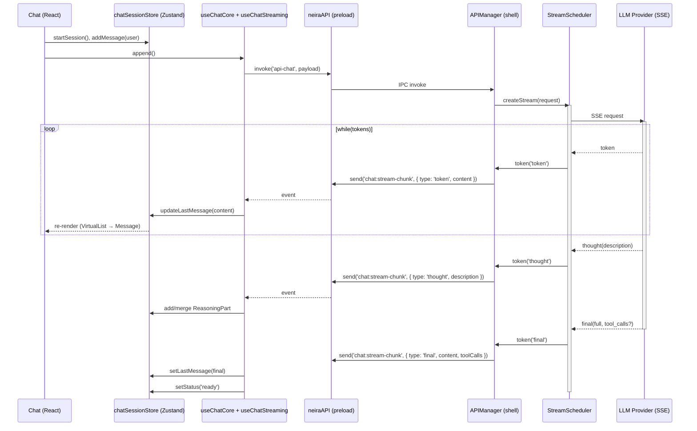
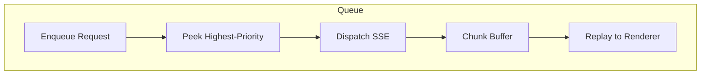
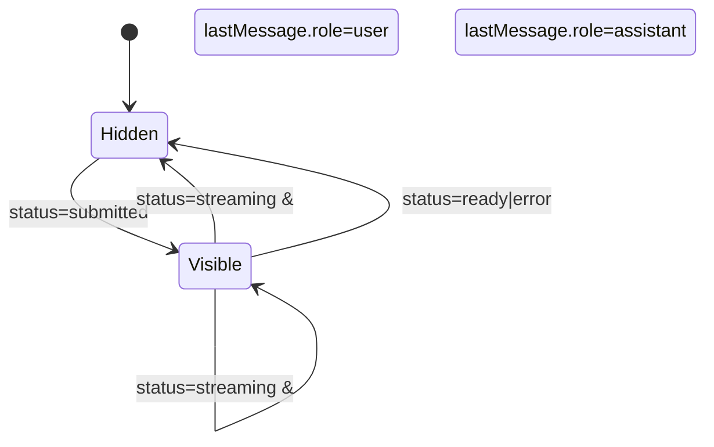

# 📡 Chat Streaming Lifecycle & UI Indicators

**Версия:** 2025-07-03 **Статус:** ✅ Canonical

> Источник: фикс `docs/fixes/fix-chat-reasoning-duplication.md`

Документ описывает _полный_ путь сообщения после нажатия «Отправить» до финального отображения в UI. Особое внимание уделяется тому, **как разбиваются чанки**, **где работает планировщик**, почему показываются **Thinking- / Reasoning-индикаторы** и какие статусы проходит система.

---

## 1. Сквозной поток данных (High-Level)

### Ключевые сущности

| Слой          | Файл / Пакет                                                | Роль                                              |
| ------------- | ----------------------------------------------------------- | ------------------------------------------------- |
| UI-React      | `features/chat/components/Chat.tsx`                         | Хост чата, подписка на стор                       |
| Zustand Store | `features/chat/services/chatSessionStore.ts`                | Источник правды для UI                            |
| Core          | `features/chat/hooks/useChatCore.ts`, `useChatStreaming.ts` | Отправка запроса, приём чанков                    |
| Preload IPC   | `packages/shell/src/preload/index.ts`                       | Безопасный мост, каналы проверяются по allow-list |
| Shell         | `packages/shell/src/main/managers/APIManager`               | Делегирует запросы к StreamScheduler              |
| Scheduler     | `packages/shell/src/main/managers/StreamScheduler.ts`       | Буферизует SSE-чанки, гарантирует порядок & QoS   |
| AI Provider   | ―                                                           | Любой LLM / RAG backend, отдаёт SSE-поток         |

---

## 2. Формат чанков

| Поле          | Тип                                          | Описание                                         |
| ------------- | -------------------------------------------- | ------------------------------------------------ |
| `type`        | `'thought' \| 'token' \| 'final' \| 'error'` | Ключевой свитч в клиентском коде                 |
| `content`     | `string?`                                    | Текст токена (`token`, `final`)                  |
| `description` | `string?`                                    | Текст reasoning (`thought`)                      |
| `toolCalls`   | `ToolCall[]?`                                | Финальные вызовы инструментов (`final`)          |
| `chatId`      | `string`                                     | Для маппинга на сессию (поддержка множ. вкладок) |

> Контракт описан в `shared-types -> IPCChannels['chat:stream-chunk']`.

### 2.1 Разбиение cтороной LLM

- **LLM / Orchestrator** режет ответ на токены (обычно 1–30 символов).
- Промежуточные размышления (Chain-of-Thought) публикуются как `thought`.
- После `[DONE]` провайдер формирует `final` объект с полным текстом.
- При ошибке формируется `error` c payload `{ message, code }`.

---

## 3. Планировщик (StreamScheduler)

> _Файл: `src/main/managers/StreamScheduler.ts`_

Зачем нужен:

1. **Приоритеты**. Если пользователь быстро отправил 3 сообщения, планировщик ставит их в очередь ⌛ и не дробит полосу пропускания на 3 SSE-канала.
2. **Контроль скорости**. Лимитирует `tokens/sec` для слабых устройств.
3. **Безопасность**. Фильтрует PII-чанки или стоп-словами до отправки в UI.

Алгоритм (упрощённо):

- **База**: `p-queue` с concurrency = `MAX_PARALLEL_STREAMS` (по умолчанию 1).
- **backpressure**: если Renderer не успевает, Buffer растёт, Scheduler снижает `tokens/sec`.

---

## 4. Статусы чата

| Статус      | Когда устанавливается                                  | Где устанавливается                |
| ----------- | ------------------------------------------------------ | ---------------------------------- |
| `idle`      | Чат открыт, ничего не введено                          | `startSession()`                   |
| `loading`   | Происходит загрузка истории чата                       | `useChatSession` (React Query)     |
| `submitted` | Пользователь нажал _Send_, запрос ушёл, ответа ещё нет | `useChatCore.append()`             |
| `streaming` | Пришёл `thought` или `token`                           | `useChatStreaming`                 |
| `ready`     | Получен `final`                                        | `useChatStreaming`                 |
| `error`     | Ошибка сети / AI                                       | `useChatStreaming` (ветка `error`) |

---

## 5. Thinking & Reasoning Indicators

### 5.1 ThinkingIndicator

| Файл                    | Условия показа                                                                             |
| ----------------------- | ------------------------------------------------------------------------------------------ |
| `ThinkingIndicator.tsx` | `status === 'submitted'` **или** (`status === 'streaming'` и последнее сообщение — _user_) |

### 5.2 ReasoningMessagePart

- Создаётся при `chunk.type === 'thought'`.
- При последующих `thought`-чанках **мерджится** (см. фикс #472).
- Кнопка сворачивания доступна после финала.

#### Управление раскрытием

| Сценарий                   | `isReasoning` | `isExpanded` initial |
| -------------------------- | ------------- | -------------------- |
| Во время стриминга         | `true`        | `true`               |
| После завершения (`final`) | `false`       | `false`              |

---

## 6. Недоработки & предложения улучшения

| Область        | Проблема                                                | Улучшение                                                                   |
| -------------- | ------------------------------------------------------- | --------------------------------------------------------------------------- |
| Scheduler QoS  | Отсутствует метрика drop-rate при backpressure          | Логировать `droppedChunks` и выдавать IPC-ивент для DevTools                |
| UI Indicators  | Переключение `status` не оптимально (2 dispatch подряд) | Использовать `batch(() => ...)` из `zustand/immer` для группировки          |
| Error Handling | Чанк `error` сейчас попадает только в консоль           | Создать `ErrorMessagePart` с UX-подсказкой «Нажмите ↻»                      |
| Shared Types   | Контракт `chat:stream-chunk` дублируется в TS и Yaml    | Сгенерировать типы из одного `.proto` (see `proto/chrome-extensions.proto`) |
| Animation Perf | `thinking-pulse` использует `box-shadow`                | Перейти на `transform: scale` + `opacity` (GPU-friendly)                    |

---

## 7. TL;DR

1. **Отправка** → сообщение пользователя мгновенно в UI (`submitted`).
2. **Scheduler** создаёт SSE-канал и буферизует чанки.
3. Первые чанки: `thought` ⇢ отображается «Reasoning», статус `streaming`, плюс остаётся `ThinkingIndicator` (если ассистент ещё не ответил).
4. `token`-чанки стримятся в `updateLastMessage`, текст постепенно появляется.
5. `final` ⇢ статус `ready`, индикаторы скрываются, кнопка «Reasoning» сворачивается.
6. Ошибка _?_ → статус `error`, показываем to-be-implemented `ErrorMessagePart`.

Документ синхронизирован с кодовой базой на **commit `<hash-placeholder>` (2025-07-03)**.
