**Версия:** 1.0  
**Статус:** ✅ **Действующий стандарт**

## ⚡ Философия

NEIRA Super App — это не просто AI-чат, а полноценная среда для разработки и автоматизации. Интеграция **Code-OSS** (open-source ядро, на котором построен VS Code) под названием **Neira Studio** является ключевым элементом этой концепции. Она позволяет пользователям и AI-агентам писать, редактировать и отлаживать код непосредственно внутри приложения.

`CodeOSSManager` — это менеджер, который полностью инкапсулирует логику этой интеграции.

**Связи:** [IPC-архитектура](/03-core-concepts/2-shell-core/06-ipc-architecture).

## 🏛️ Архитектура: Изолированное окно

В отличие от вкладок, которые являются `WebContentsView`, Neira Studio запускается в отдельном, полноценном `BrowserWindow`. Это обеспечивает полную изоляцию от основного приложения и позволяет использовать все возможности Code-OSS без компромиссов.

```mermaid
graph TD
    subgraph "NEIRA Super App"
        A[Основное окно]
        B[WindowManager]
    end

    subgraph "Neira Studio"
        C[Окно Code-OSS]
    end

    D(CodeOSSManager) -- "Создает и управляет" --> C
    B -- "Взаимодействует с" --> D

    style C fill:#2a2a2a,stroke:#444,stroke-width:2px
```

### `CodeOSSManager`

Этот менеджер отвечает за все аспекты жизненного цикла и конфигурации Neira Studio.

1. **Управление окном**:

   - `createCodeWindow()`: Создает новое `BrowserWindow`, загружая в него сборку Code-OSS.
   - `toggle()`: Показывает или скрывает окно студии. Доступно по горячей клавише (`CommandOrControl+Shift+C`).

2. **Управление расширениями**:

   - **Централизованное хранилище**: Создает и управляет директорией `extensions` внутри `app.getPath('userData')`. Это гарантирует, что все расширения персистентны и доступны между сессиями.
   - **Hot-Reload**: Использует `chokidar` для отслеживания изменений в директории расширений. При добавлении, изменении или удалении файла расширения, `CodeOSSManager` автоматически перезагружает их, что критически важно для быстрой итеративной разработки плагинов.

3. **Интеграция и конфигурация**:
   - **Динамическая тема**: Перед открытием окна студии, менеджер запрашивает текущую тему (`light`/`dark`) у `WindowManager` и передает ее в Code-OSS. Это обеспечивает бесшовный и консистентный пользовательский опыт.
   - **IPC-интерфейс**: Регистрирует каналы (`codeoss:toggle`, `codeoss:get-state`), позволяя другим частям системы (и AI-агентам) управлять студией.

## 🔄 Поток открытия Neira Studio

1. **Пользователь** нажимает `CommandOrControl+Shift+C`.
2. **`CodeOSSManager`** перехватывает горячую клавишу и вызывает метод `toggle()`.
3. Если окно еще не создано, запускается `createCodeWindow()`:
   - Создается новый `BrowserWindow`.
   - Определяется путь к сборке Code-OSS.
   - Запрашивается текущая тема у `WindowManager`.
   - Формируется URL с параметрами (`vscode-theme`, `extensions-dir`, и т.д.).
   - Окно загружает этот URL.
4. Окно Neira Studio отображается и фокусируется.

## 📦 Расширения

Расширения — это сердце Neira Studio. Они позволяют расширять функциональность и адаптировать среду под конкретные задачи.

- **Установка**: Расширения могут быть установлены программно через `installExtension()`, что позволяет AI-агентам самостоятельно добавлять необходимые инструменты.
- **Разработка**: Благодаря hot-reload, разработчики могут видеть изменения в своих плагинах без перезапуска всего приложения, что значительно ускоряет цикл разработки.

Интеграция Code-OSS превращает NEIRA Super App из простого приложения в мощную платформу для создания и автоматизации, где AI и человек могут совместно работать над кодом.
