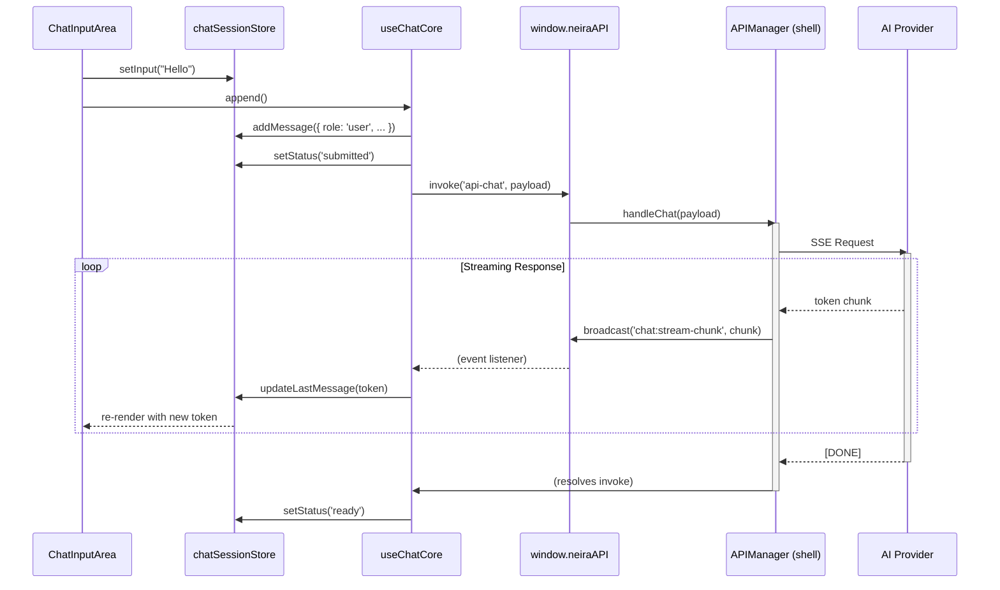

# 📖 Chat Core Architecture

**Версия:** 2025-07-03 **Статус:** ✅ Canonical

Этот документ — единственный источник правды по архитектуре чата в `neira-app`. Он описывает состояние после рефакторинга _Daebak 2.0_, который унифицировал управление состоянием через `Zustand` и `React Query`.

---

## 1. Философия и разделение состояний

Архитектура чата следует принципу **SSOT (Single Source of Truth)** для каждого типа данных, чтобы избежать десинхронизации и "гонки состояний".

1. **`chatSessionStore` (Zustand) — источник правды для UI.**

    - **Отвечает за:** текущие сообщения в сессии, статус (`loading`, `streaming`), содержимое поля ввода (`input`), ошибки.
    - **Жизненный цикл:** Состояние создается при входе в чат и очищается при выходе. Это эфемерное состояние, живущее только во время активной сессии.
    - **Почему Zustand?** Идеален для часто обновляемого, синхронного UI-состояния. `Immer`-мидлвара обеспечивает иммутабельные обновления.

2. **React Query — кэш для серверных данных.**

    - **Отвечает за:** список чатов пользователя (`['chats', userId]`) и историю сообщений конкретного чата (`['chat', chatId]`).
    - **Жизненный цикл:** Данные запрашиваются через IPC, кэшируются и автоматически инвалидируются, обеспечивая консистентность с `shell`.
    - **Почему React Query?** Управляет асинхронными операциями (загрузка, ошибки), фоновой синхронизацией и оптимистичными обновлениями.

3. **Компоненты — «глупые» и декларативные.**
    - UI-компоненты (`Chat`, `MessageList`, `ChatInputArea`) **не содержат собственной логики состояния**.
    - Они подписываются напрямую на `useChatSessionStore` и получают все необходимые данные и экшены. Проп-дриллинг сведен к минимуму.

---

## 2. Поток данных: от ввода до отрисовки токена

Ключевой сценарий — отправка сообщения и получение потокового ответа.



**Ключевые моменты:**

- **Оптимистичное обновление:** Сообщение пользователя добавляется в `chatSessionStore` _до_ отправки запроса на сервер.
- **Однонаправленный поток:** UI вызывает экшены, `useChatCore` оркестрирует IPC, `APIManager` работает с AI, события стриминга летят обратно и обновляют стор, что вызывает ре-рендер UI.
- **Декомпозиция:** `useChatCore` не занимается напрямую подписками на стриминг. Эту логику инкапсулирует хук `useChatStreaming`, который вызывается внутри `useChatCore`.

---

## 3. Ключевые хуки и их зоны ответственности

| Хук                   | Зона ответственности                                                                             | Основные зависимости                                        |
| --------------------- | ------------------------------------------------------------------------------------------------ | ----------------------------------------------------------- |
| `useChatCore`         | **Оркестратор.** Собирает все части вместе, управляет `append`, обрабатывает результат IPC.      | `useChatSessionStore`, `useChatSession`, `useChatStreaming` |
| `useChatSessionStore` | **Состояние сессии (Zustand).** Хранит сообщения, статус, input. Предоставляет экшены.           | `zustand`, `immer`                                          |
| `useChatSession`      | **Кэш истории (React Query).** Загружает и кэширует историю сообщений для `chatId`.              | `@tanstack/react-query`                                     |
| `useChatStreaming`    | **Подписчик на IPC.** Слушает `chat:stream-chunk` и вызывает экшены стора (`updateLastMessage`). | `window.neiraAPI`                                           |
| `useChatState`        | **Состояние UI-контейнера.** Управляет ID чата, синхронизируя URL и стор.                        | `useChatUIStore`                                            |

---

## 4. Современные принципы разработки чата

### 4.1 Реактивность и производительность

- **Иммутабельные обновления:** Все изменения состояния создают новые объекты/массивы
- **Minimal re-renders:** Компоненты подписываются только на нужную часть стора
- **Streaming optimizations:** Токены добавляются без пересоздания всего массива сообщений

### 4.2 Отказоустойчивость

- **Graceful degradation:** При сбое стриминга отображается частичное сообщение
- **Error boundaries:** React Error Boundaries изолируют сбои компонентов
- **Retry logic:** Автоматические повторы при временных сбоях

### 4.3 Тестируемость

```typescript
// Пример тестирования чат-логики
describe('Chat State Management', () => {
  it('should add message optimistically', () => {
    const store = useChatSessionStore.getState()
    store.addMessage({ role: 'user', content: 'test' })
    expect(store.messages).toHaveLength(1)
  })
})
``` 