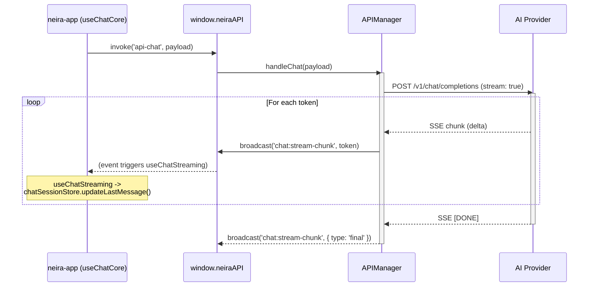

# 🤖 AI Engine & Streaming Architecture

**Версия:** 2025-07-03 **Статус:** ✅ Canonical

Этот документ описывает архитектуру движка ИИ в `shell` и его взаимодействие с UI-слоем (`neira-app`) для обеспечения потоковой передачи ответов.

---

## 1. Компоненты и их роли

| Компонент                | Слой        | Зона ответственности                                                                                                                                                        |
| ------------------------ | ----------- | --------------------------------------------------------------------------------------------------------------------------------------------------------------------------- |
| `APIManager`             | `shell`     | **Центральный шлюз.** Принимает IPC-запросы `api-chat`, выбирает провайдера, вызывает стриминг, обрабатывает tool-calling и пушит события `chat:stream-chunk` обратно в UI. |
| `OpenRouterModelService` | `shell`     | **Реестр моделей.** Управляет списком доступных моделей, их свойствами (поддержка tools, контекстное окно) и тарифами.                                                      |
| `TariffService`          | `shell`     | **Контроль доступа.** Проверяет, имеет ли пользователь доступ к запрашиваемой модели согласно его тарифному плану.                                                          |
| `useChatStreaming`       | `neira-app` | **Подписчик на стрим.** Слушает событие `chat:stream-chunk` и обновляет `chatSessionStore` (Zustand) по мере прихода токенов.                                               |
| `PolylithChatService`    | `shell`     | **Сервис персистентности.** Сохраняет историю сообщений в базу данных после успешного ответа от LLM.                                                                        |

---

## 2. Поток данных (Happy Path: Streaming)

**Ключевые особенности:**

1. **Настоящий SSE:** `APIManager` устанавливает прямое SSE-соединение с провайдером (OpenAI, OpenRouter) и транслирует чанки "as-is" через IPC.
2. **Тонкий UI-клиент:** Вся логика выбора модели, обработки ошибок и работы с провайдерами инкапсулирована в `APIManager`. UI-слой (`neira-app`) просто отправляет запрос и подписывается на событие.
3. **Graceful Fallback:** Если у пользователя нет API-ключей для прямого стриминга или модель его не поддерживает, `APIManager` автоматически переключается в буферизованный режим, получает полный ответ и отправляет его одним `final` чанком.

---

## 3. Маппинг моделей и выбор провайдера

`APIManager` использует простую логику для определения, какую стриминговую функцию вызвать:

| Префикс / Паттерн    | Провайдер  | Метод в `APIManager`           | Поддержка SSE     |
| -------------------- | ---------- | ------------------------------ | ----------------- |
| `gpt-*`              | OpenAI     | `streamOpenAIResponse()`       | ✅                |
| `*/` (содержит слэш) | OpenRouter | `streamOpenRouterResponse()`   | ✅                |
| _прочее_             | (N/A)      | `generateAIResponse()` (буфер) | ❌                |
| `claude-*`           | Anthropic  | `generateAIResponse()` (буфер) | ⏳ (в разработке) |

---

## 4. Обработка ошибок

| Сценарий                | Поведение `APIManager`                                                      | Реакция UI                                                                            |
| ----------------------- | --------------------------------------------------------------------------- | ------------------------------------------------------------------------------------- |
| `429 Too Many Requests` | Автоматический retry с экспоненциальной задержкой (до 3 раз).               | UI не видит ошибки, просто ответ приходит с задержкой.                                |
| Ошибка сети / SSE       | `APIManager` логирует ошибку и пытается выполнить запрос в буферном режиме. | Ответ приходит одним целым сообщением вместо потока.                                  |
| Невалидный API-ключ     | Ошибка от провайдера транслируется в UI.                                    | В `chatSessionStore` устанавливается поле `error`, UI показывает сообщение об ошибке. |
| Tool Timeout            | `APIManager` возвращает ошибку выполнения инструмента.                      | Сообщение об ошибке показывается в чате.                                              |

---

## 5. Revision History

| Дата       | Версия | Автор      | Изменение                                                                                       |
| ---------- | ------ | ---------- | ----------------------------------------------------------------------------------------------- |
| 2025-07-03 | 2.1    | @ai-dev    | Актуализация под архитектуру Daebak 2.0. Удален `useNeiraChat`, добавлена роль `TariffService`. |
| 2025-07-02 | 2.0    | @docs-team | Полное наполнение, добавлены разделы Error Matrix & Security.                                   |
