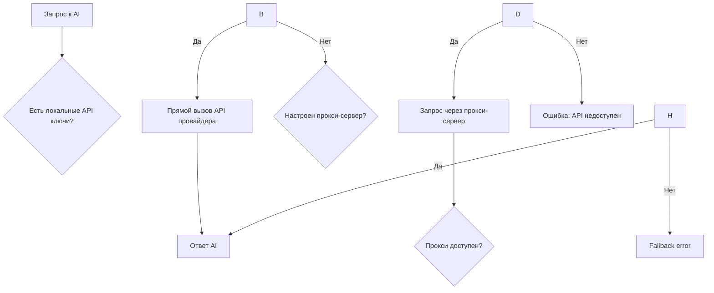

<!-- Этот документ описывает функциональность, управляемую ProxyManager. -->

# 🔗 Прокси-сервер для AI API

## Обзор

NEIRA Super App включает встроенную систему прокси-сервера для AI API, которая автоматически направляет запросы на дефолтные API ключи, когда локальные ключи недоступны. Это обеспечивает непрерывную работу AI-функций даже без настройки собственных API ключей.

## Архитектура

За данную функциональность отвечает `ProxyManager`, который управляет жизненным циклом и конфигурацией `ProxyService`.

### Компоненты

1. **ProxyService** (`packages/shell/src/main/managers/services/ProxyService.ts`)

   - Основной сервис для работы с прокси-сервером
   - Обработка HTTP-запросов к backend
   - Retry логика и обработка ошибок

2. **APIManager** - интеграция прокси в основной AI pipeline

   - Автоматический выбор между прямыми API и прокси
   - Логирование и мониторинг

3. **ProxyStatus** (`packages/neira-app/components/common/ProxyStatus.tsx`)
   - UI компонент для отображения статуса прокси
   - Доступен в настройках приложения

### Принцип fallback



## Конфигурация

### Переменные окружения

```bash
# Обязательная переменная для активации прокси
NEIRA_BACKEND_URL=https://api.neira.sale

# Локальные API ключи (приоритет над прокси)
OPENAI_API_KEY=your_openai_key
ANTHROPIC_API_KEY=your_anthropic_key
OPENROUTER_API_KEY=your_openrouter_key
```

### Условия использования прокси

Прокси используется автоматически, если:

1. **Отсутствуют локальные API ключи** для требуемого провайдера
2. **Настроена переменная** `NEIRA_BACKEND_URL`
3. **Прокси-сервер доступен** (проходит health check)

## API прокси-сервера

### Health Check

```http
GET /health
Response: \{"status": "ok", "timestamp": "2025-01-26T15:30:00Z"}
```

### Генерация текста

```http
POST /api/v1/chat/completions
Headers: User-Agent: NEIRA-SuperApp/1.0.0, X-Client-ID: neira-super-app
```

**Запрос:**

```json
\{
  "model": "gpt-4o-mini",
  "messages": [\{"role": "user", "content": "Hello!"}],
  "maxTokens": 1000,
  "temperature": 0.7,
  "userId": "user-123"
}
```

## Мониторинг и отладка

### IPC API для статистики

```typescript
const proxyStats = await window.neiraAPI.invoke('api-proxy-stats')
// Возвращает: {isAvailable: boolean, backendUrl: string, healthStatus: boolean}
```

### UI мониторинг

Компонент `ProxyStatus` отображает:

- ✅ **Активен** - прокси работает нормально
- ❌ **Недоступен** - прокси-сервер не отвечает
- ⚪ **Отключен** - переменная `NEIRA_BACKEND_URL` не настроена

### Логирование

```
🔗 [ProxyService] Initialized with backend URL: https://api.neira.sale
🔗 [ProxyService] Sending request to proxy backend: {model: gpt-4o-mini}
🔗 [ProxyService] Successfully received response from proxy backend
```

## Обработка ошибок

### Retry механизм

- **Автоматические повторы** при сетевых ошибках
- **Экспоненциальная задержка** между попытками
- **Максимум 2 попытки** по умолчанию

### Типы ошибок

1. **Сетевые ошибки** - повтор с задержкой
2. **HTTP ошибки** (4xx, 5xx) - немедленный возврат ошибки
3. **Timeout** - прерывание запроса через 30 секунд
4. **Некорректный ответ** - валидация JSON

## Безопасность

### Заголовки

- `User-Agent: NEIRA-SuperApp/1.0.0` - идентификация клиента
- `X-Client-ID: neira-super-app` - ID приложения
- `X-Request-ID: req_...` - уникальный ID запроса

### Timeout

- **Health check**: 5 секунд
- **Генерация**: 30 секунд
- **AbortController** для корректной отмены запросов

## Интеграция в UI

### Страница настроек

```typescript
import \{ ProxyStatus } from '@/components/common/ProxyStatus'

// Полная карточка с деталями
`<ProxyStatus />`

// Компактный бейдж
`<ProxyStatus showDetails={false} />`
```

### Автообновление

Статус обновляется при загрузке страницы, по клику "Обновить" и при изменении настроек.

## Разработка и тестирование

### Локальная разработка

```bash
# 1. Установить переменную окружения
export NEIRA_BACKEND_URL=http://localhost:8080

# 2. Убрать локальные API ключи
unset OPENAI_API_KEY ANTHROPIC_API_KEY

# 3. Запустить приложение
yarn start:fast
```

### Unit тесты

```bash
npx vitest run packages/shell/src/main/managers/services/__tests__/ProxyService.test.ts
```

## Лучшие практики

### Производительность

- ✅ Переиспользуйте ProxyService instance
- ✅ Настройте разумные timeout'ы
- ✅ Мониторьте retry логику

### Надежность

- ✅ Всегда проверяйте health check
- ✅ Логируйте важные события
- ✅ Обрабатывайте все типы ошибок

### UX

- ✅ Показывайте статус прокси пользователю
- ✅ Объясняйте зачем нужен прокси
- ✅ Предоставляйте fallback опции

## Заключение

Прокси-сервер для AI API обеспечивает seamless опыт для пользователей NEIRA Super App, автоматически предоставляя доступ к AI-функциям даже без настройки собственных API ключей. Система спроектирована с учетом надежности, производительности и простоты использования.
