**Версия:** 1.2  
**Статус:** ✅ **Действующий стандарт**

## ⚡ Философия

Для выполнения сложных задач, требующих экосистемы Python (например, работа с ML-моделями, сложный анализ данных), NEIRA Super App использует гибридный подход. `PythonAPIManager` в `shell` выступает в роли моста, который запускает и управляет локальным Python-бэкендом, обеспечивая бесшовное взаимодействие между мирами Node.js и Python через высокопроизводительный протокол gRPC.

**Принцип:** Использовать лучший инструмент для каждой задачи. JavaScript для UI и управления, Python — для вычислений и AI.

**Связи:** [Архитектура Менеджеров](/core-concepts/architecture-patterns/manager-architecture).

## 🏛️ Архитектура: Локальный бэкенд и gRPC

Взаимодействие строится на запуске скомпилированного Python-приложения как дочернего процесса и коммуникации с ним через gRPC.

```mermaid
graph TD
    subgraph "shell (Main Process)"
        A[PythonAPIManager]
    end

    subgraph "Python Backend (Child Process)"
        B[Исполняемый файл Python]
        C[gRPC Server]
        B --> C
    end

    A -- "spawn()" --> B
    A -- "gRPC Client" <--> C

    style B fill:#333,stroke:#555
    style C fill:#444,stroke:#666
```



### `PythonAPIManager`

Этот менеджер полностью инкапсулирует логику управления Python-агентом.

1. **Управление процессом**:

   - **Запуск и ожидание готовности (Robust Initialization)**: При инициализации `PythonAPIManager` находит и запускает исполняемый файл Python-агента. Он активно слушает стандартный вывод (`stdout`) дочернего процесса, ожидая специальный маркер (`AGENT_READY`), который сигнализирует о готовности агента.
   - **Кроссплатформенность**: Путь к исполняемому файлу определяется динамически на основе платформы (`process.platform`) и архитектуры (`process.arch`), что обеспечивает работу на macOS (ARM/Intel), Windows и Linux.
   - **Отказоустойчивость**: Если исполняемый файл отсутствует, менеджер не прерывает работу приложения, а переключается в **mock-режим**. Этот же режим используется, если агент не смог запуститься или пройти проверку работоспособности. Это позволяет вести разработку UI без необходимости иметь запущенный Python-бэкенд.

2. **Взаимодействие через gRPC**:
   - **Соединение**: После запуска Python-процесса, менеджер инициализирует gRPC-клиент, который подключается к gRPC-серверу внутри Python-агента. Для максимальной производительности и безопасности используется **Unix-сокет** (на macOS/Linux) или **именованный канал** (на Windows).
   - **Health Check с экспоненциальной задержкой**: Если маркер `AGENT_READY` не был получен вовремя, `PythonAPIManager` не сдаётся. Он запускает отказоустойчивый механизм проверки: выполняет до 3-х попыток вызова `healthCheck()` с нарастающей задержкой (0.5с, 1с, 2с). Этот подход (exponential backoff) позволяет дождаться полной готовности агента, который может медленно запускаться, и значительно повышает надёжность инициализации.
   - **API**: Предоставляет асинхронные, типизированные методы (`processPrompt`, `callCustomFunction`) для вызова процедур на Python-сервере. Вся сложность gRPC скрыта за этими простыми вызовами.

### Python-агент

- **Исполняемый файл**: Это скомпилированное с помощью PyInstaller (или аналога) Python-приложение, которое не требует от пользователя установленного Python или зависимостей.
- **gRPC-сервер**: Внутри Python-приложения запускается gRPC-сервер, который реализует сервисы, определенные в `.proto` файлах. Он слушает на локальном сокете и обрабатывает запросы от `PythonAPIManager`.

## 🔄 Поток вызова Python-функции

1. **Менеджер в `shell`** (например, `APIManager`) решает, что задачу нужно делегировать Python.
2. Он вызывает метод `PythonAPIManager`:

   ```typescript
   // APIManager.ts
   const response = await this.pythonAPIManager.processPrompt(\{ prompt: 'Анализируй этот текст...' });
   ```

3. **`PythonAPIManager`**:
   - Проверяет, что gRPC-клиент готов.
   - Вызывает соответствующий метод gRPC-клиента: `this.grpcClient.processPrompt(...)`.
4. **Python-агент (gRPC Server)**:
   - Получает запрос.
   - Выполняет необходимую логику (например, обрабатывает текст с помощью библиотеки `nltk`).
   - Отправляет ответ.
5. **`PythonAPIManager`** получает ответ и возвращает его в `APIManager`.

## 🛠️ Кроссплатформенная интеграция и отказоустойчивость

### Кроссплатформенные пути к сокету (PYTHON:SOCKET_PATH_CROSS_PLATFORM)

**Решенная проблема:** Несоответствие путей к сокету между Python-агентом (`tempfile.gettempdir()`) и PythonAPIManager (`/tmp/` жестко задано) вызывало ошибки подключения.

**Решение:** Унификация через `os.tmpdir()` в TypeScript и переменную окружения `NEIRA_SOCKET_PATH` для кроссплатформенности.

```typescript
// Node.js (PythonAPIManager.ts)
private getSocketPath(): string {
  if (platform() === 'win32') {
    return '127.0.0.1:50051' // TCP для Windows
  } else {
    // Используем тот же путь к временной директории, что и Python-агент
    const tempDir = os.tmpdir()
    return `unix://${path.join(tempDir, 'neira_agent.sock')}` // Unix socket для macOS/Linux
  }
}
```

```python
# Python (agent.py)
def get_socket_path():
    """Определяет путь к Unix-сокету в зависимости от ОС"""
    # Используем переменную окружения, если она установлена
    env_socket_path = os.environ.get('NEIRA_SOCKET_PATH')
    if env_socket_path:
        return f"unix://{env_socket_path}" if platform.system() != "Windows" else env_socket_path

    # Или стандартный путь к временной директории
    temp_dir = tempfile.gettempdir()
    socket_name = 'neira_agent.sock'
    return f"unix://{os.path.join(temp_dir, socket_name)}" if platform.system() != "Windows" else "127.0.0.1:50051"
```

Пути к временным файлам на разных ОС:

- macOS: `/var/folders/XX/XXXXXXXXXXXXXXXXXXXXXXXXXXXX/T/`
- Linux: `/tmp/`
- Windows: `C:\Users\USERNAME\AppData\Local\Temp\`

Для обеспечения согласованности путей между Node.js и Python, `PythonAPIManager` передает путь к сокету через переменную окружения `NEIRA_SOCKET_PATH` при запуске Python-агента:

```typescript
// Извлекаем путь к сокету без 'unix://' префикса для передачи в переменной окружения
const socketFilePath = this.socketPath.replace('unix://', '')

this.pythonProcess = spawn(this.agentPath, [], {
  env: {
    ...process.env,
    NEIRA_AGENT_MODE: 'production',
    NEIRA_LOG_LEVEL: 'info',
    NEIRA_SOCKET_PATH: socketFilePath, // Передаем путь к сокету
  },
})
```

**Результат:** Устранены ошибки подключения, обеспечена совместимость Windows через TCP.

### Решение race condition и повышение стабильности (PYTHON:GRPC_RACE_CONDITION_FIX)

**Решенная проблема:** Race condition при инициализации - Node.js клиент подключался до готовности gRPC сервера, вызывая сбои инициализации и переключение в mock-режим даже при исправном агенте.

**Решение:** Многоуровневая стратегия: сигнал готовности `AGENT_READY` + health check с экспоненциальной задержкой.

Для предотвращения проблемы race condition реализован надежный механизм ожидания:

1. **Проверка наличия и доступности сокета** перед первой попыткой подключения:

   ```typescript
   private async waitForSocketReady(socketPath: string, timeoutMs = 15000): Promise<boolean> {
     const plainPath = socketPath.replace('unix://', '')
     const startTime = Date.now()

     while (Date.now() - startTime < timeoutMs) {
       try {
         // Проверяем наличие файла сокета
         if (fs.existsSync(plainPath)) {
           this.logger.info(`✓ gRPC сокет найден: ${plainPath}`)
           return true
         }

         this.logger.debug(`Ожидание готовности gRPC сокета по пути: ${plainPath}`)
         await new Promise(resolve => setTimeout(resolve, 500))
       } catch (error) {
         this.logger.error(`❌ Ошибка при ожидании готовности gRPC сокета: ${error.message}`)
       }
     }

     this.logger.error(`⏱️ Превышено время ожидания появления сокета (${timeoutMs}ms)`)
     return false
   }
   ```

2. **Ожидание сигнала готовности:** `PythonAPIManager` активно слушает `stdout` запускаемого Python-процесса. Он ожидает строку-маркер (`AGENT_READY`), которая явно сигнализирует о том, что gRPC-сервер запущен и готов принимать соединения.

3. **Экспоненциальная задержка** для health-check'ов для преодоления временных проблем с соединением:

   ```typescript
   private async performHealthCheck(retries = 3): Promise<boolean> {
     for (let attempt = 1; attempt <= retries; attempt++) {
       try {
         const response = await (this.grpcClient as any).HealthCheck({ service: 'python-agent' })
         if (response?.healthy) {
           this.logger.info(`✅ Python Agent health check пройден: ${response.message} (v${response.version})`)
           return true
         }

         this.logger.warn(`⚠️ Получен отрицательный health check ответ: ${response?.message || 'Нет сообщения'}`)
       } catch (error) {
         const delay = Math.pow(2, attempt - 1) * 500 // 500ms, 1000ms, 2000ms, 4000ms...
         this.logger.warn(`⚠️  HealthCheck неудачен (попытка ${attempt}/${retries}). Повтор через ${delay} мс...`)
         await new Promise(resolve => setTimeout(resolve, delay))
       }
     }

     this.logger.error(`❌ Не удалось подтвердить готовность Python Agent после ${retries} попыток — переходим в мок-режим`)
     return false
   }
   ```

4. **Улучшенное логирование** в Python-агенте для точной диагностики проблем:

   ```python
   def HealthCheck(self, request, context):
       """Проверка здоровья сервиса"""
       logger.info(f"🔍 Health check запрос для сервиса: {request.service}")

       # Выводим детали запроса для отладки
       logger.debug(f"🔍 Детали запроса: {request}")
       logger.debug(f"🔍 Метаданные запроса: {context.invocation_metadata()}")

       response = agent_pb2.HealthCheckResponse(
           healthy=True,
           message="Python Agent работает корректно",
           version=self.version
       )

       logger.info(f"✅ Отправляем ответ health check: {response}")
       return response
   ```

### Решение проблемы регистра имен методов в gRPC

gRPC требует точного соответствия имен методов, включая регистр. При этом в разных языках используются разные соглашения:

- TypeScript/JavaScript обычно использует camelCase (healthCheck)
- Python при генерации из .proto файлов использует PascalCase (HealthCheck)

Для решения этой проблемы реализован универсальный хелпер:

```typescript
private callGrpcMethod(methodName: string, request: any): Promise<any> {
  if (!this.grpcClient) {
    throw new Error('gRPC клиент не инициализирован')
  }

  // Проверяем наличие метода с точным регистром
  if (typeof (this.grpcClient as any)[methodName] === 'function') {
    return (this.grpcClient as any)[methodName](/)10804
  }

  // Проверяем наличие метода с заглавной буквы (PascalCase)
  const pascalCaseMethod = methodName.charAt(0).toUpperCase() + methodName.slice(1)
  if (typeof (this.grpcClient as any)[pascalCaseMethod] === 'function') {
    this.logger.debug(`Вызываем метод ${pascalCaseMethod} (преобразован из ${methodName})`)
    return (this.grpcClient as any)[pascalCaseMethod](/)11177
  }

  // Если метод не найден, логируем доступные методы
  const availableMethods = Object.keys(this.grpcClient)
  this.logger.error(`Метод ${methodName} не найден. Доступные методы: ${availableMethods.join(', ')}`)
  throw new Error(`Метод ${methodName} не найден в gRPC клиенте`)
}
```

**Результат:** Полная совместимость между TypeScript и Python при вызове gRPC-методов, независимо от соглашений об именовании.

## ⚡ Оптимизация производительности

### Circuit Breaker Pattern для Python API

**Проблема:** Нестабильный запуск с 15-секундным таймаутом приводил к каскадным сбоям.

**Решение:** Внедрение Circuit Breaker pattern для стабилизации:

```typescript
class PythonAPICircuitBreaker {
  private failures = 0
  private state: 'CLOSED' | 'OPEN' | 'HALF_OPEN' = 'CLOSED'
  private readonly failureThreshold = 5
  private readonly timeout = 30000 // 30 секунд

  async call<T>(operation: () => Promise<T>): Promise<T> {
    if (this.state === 'OPEN') {
      if (Date.now() - this.lastFailureTime > this.timeout) {
        this.state = 'HALF_OPEN'
      } else {
        throw new Error('Circuit breaker is OPEN')
      }
    }

    try {
      const result = await operation()
      this.onSuccess()
      return result
    } catch (error) {
      this.onFailure()
      throw error
    }
  }
}
```

### Структурированное логирование ошибок

**Проблема:** "Тихие" ошибки без детализации затрудняли диагностику.

**Решение:** Структурированные ошибки с контекстом:

```typescript
interface StructuredError {
  message: string
  stack: string
  context: Record<string, any>
  timestamp: string
  channel: string
}
```

### Метрики производительности

```typescript
const PYTHON_API_METRICS = {
  'python_api.initialization_time': histogram(),
  'python_api.circuit_breaker_state': gauge(),
  'python_api.failure_rate': histogram(),
  'python_api.recovery_time': histogram(),
  'grpc.response_time': histogram(),
}
```

**Ожидаемые улучшения:**

- Инициализация: 15s → менее 3s (80% улучшение)
- Диагностика ошибок: Высокое → менее 30s (80% улучшение)
- Стабильность: Нестабильно → 100%

## ✅ Преимущества

- **Производительность**: gRPC работает поверх HTTP/2 и использует Protocol Buffers для сериализации, что значительно быстрее, чем JSON-over-HTTP. Использование Unix-сокетов исключает сетевой оверхед.
- **Строгая типизация**: Контракт взаимодействия определяется в `.proto` файлах, что обеспечивает строгую типизацию на стороне клиента (TypeScript) и сервера (Python).
- **Изоляция**: Python-агент работает в отдельном процессе. Его падение не повлияет на стабильность основного приложения.
- **Простота развертывания**: Пользователю не нужно ничего устанавливать. Все зависимости включены в исполняемый файл.
- **Отказоустойчивость**: Механизмы экспоненциальной задержки, проверки готовности сокета и адаптации к различным соглашениям об именовании обеспечивают высокую стабильность интеграции.

---

## 📋 Revision History

| Дата       | Версия | Изменение                                                                | ID Знания |
| ---------- | ------ | ------------------------------------------------------------------------ | --------- |
| 2025-08-05 | 2.0    | Интеграция знаний из Phase 2: стабильность gRPC, кроссплатформенные пути | PYTHON:\* |
| 2025-XX-XX | 1.2    | Документ существовал, консолидированы базовые принципы                   | -         |
