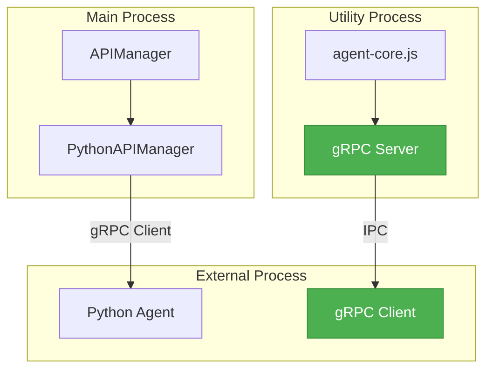

**Версия:** 1.0  
**Статус:** ✅ **Действующий стандарт**

## ⚡ Обзор

NEIRA Super App использует gRPC для высокопроизводительного взаимодействия с внешними процессами, такими как Python-агенты. Этот документ описывает архитектуру gRPC API и основные примеры использования.

**Связи:** [Интеграция с Python (gRPC)](/core-concepts/ai-engine/python-integration), [Архитектура AI](/core-concepts/ai-engine/ai-architecture), [gRPC Troubleshooting](/core-concepts/ai-engine/grpc-troubleshooting), [gRPC Methods Reference](/core-concepts/ai-engine/grpc-methods-reference).

## 🏛️ Архитектура gRPC в NEIRA Super App

gRPC API используется в двух основных компонентах:

1. **agent-core.js** — Utility Process, который запускает gRPC-сервер для обслуживания запросов от других процессов.
2. **PythonAPIManager** — Менеджер в Main Process, который взаимодействует с Python-агентом через gRPC-клиент.



## 📋 Proto-определения

Контракт взаимодействия определен в файле `proto/agent.proto`. Основной сервис:

```protobuf
service PythonAgentService {
  // Здоровье сервиса
  rpc HealthCheck(HealthCheckRequest) returns (HealthCheckResponse) {}
  
  // Основные AI операции
  rpc ProcessPrompt(PromptRequest) returns (PromptResponse) {}
  rpc ProcessStreamingPrompt(PromptRequest) returns (stream PromptStreamResponse) {}
  
  // Управление контекстом
  rpc SetContext(ContextRequest) returns (ContextResponse) {}
  rpc GetContext(GetContextRequest) returns (ContextResponse) {}
  
  // Файловые операции
  rpc ProcessFile(FileRequest) returns (FileResponse) {}
  rpc ListFiles(ListFilesRequest) returns (ListFilesResponse) {}
  
  // Вызов кастомных функций
  rpc CallCustomFunction(CustomFunctionRequest) returns (CustomFunctionResponse) {}

  // Desktop команды
  rpc DesktopClick(DesktopClickRequest) returns (DesktopClickResponse) {}
  rpc DesktopType(DesktopTypeRequest) returns (DesktopTypeResponse) {}

  // Browser команды
  rpc BrowserNavigate(BrowserNavigateRequest) returns (BrowserNavigateResponse) {}
  rpc BrowserClick(BrowserClickRequest) returns (BrowserClickResponse) {}
  rpc BrowserGetHTML(BrowserGetHTMLRequest) returns (BrowserGetHTMLResponse) {}
}
```

## 🔄 Примеры использования gRPC API

### 1. Проверка здоровья сервиса (HealthCheck)

**Клиентский код (TypeScript):**

```typescript
// В PythonAPIManager.ts
async checkHealth(): Promise<PythonAgentHealth> {
  try {
    if (!this.grpcClient) {
      this.logger.error('gRPC клиент не инициализирован — переходим в мок-режим')
      return { healthy: false, message: 'gRPC client not initialized', version: 'unknown' }
    }

    const response = await this.callGrpcMethod('healthCheck', { service: 'python-agent' })
    
    return {
      healthy: response.healthy,
      message: response.message,
      version: response.version
    }
  } catch (error) {
    this.logger.error('Ошибка при проверке здоровья Python-агента:', error)
    return { healthy: false, message: error.message, version: 'unknown' }
  }
}
```

### 2. Обработка промпта (ProcessPrompt)

**Клиентский код (TypeScript):**

```typescript
// В PythonAPIManager.ts
async processPrompt(request: PromptRequest): Promise<PromptResponse> {
  try {
    // Преобразуем TypeScript интерфейс в формат, понятный gRPC
    const grpcRequest = {
      prompt: request.prompt,
      model: request.model || 'default',
      parameters: request.parameters || {},
      context: request.context || [],
      max_tokens: request.maxTokens || 1024,
      temperature: request.temperature || 0.7
    }

    const response = await this.callGrpcMethod('processPrompt', grpcRequest)
    
    return {
      response: response.response,
      success: response.success,
      error: response.error,
      metadata: response.metadata
    }
  } catch (error) {
    this.logger.error('Ошибка при обработке промпта:', error)
    return {
      response: '',
      success: false,
      error: error.message
    }
  }
}
```

### 3. Вызов кастомной функции (CallCustomFunction)

**Клиентский код (TypeScript):**

```typescript
async callCustomFunction(functionName: string, args: string[], kwargs: Record<string, string>): Promise<CustomFunctionResponse> {
  try {
    const request = {
      function_name: functionName,
      args: args,
      kwargs: kwargs
    }

    const response = await this.callGrpcMethod('callCustomFunction', request)
    
    return {
      result: response.result,
      success: response.success,
      error: response.error,
      returnType: response.return_type
    }
  } catch (error) {
    this.logger.error(`Ошибка при вызове функции ${functionName}:`, error)
    return {
      result: '',
      success: false,
      error: error.message,
      returnType: 'error'
    }
  }
}
```

## 🔧 Инициализация gRPC клиента

Пример инициализации gRPC клиента с обработкой ошибок:

```typescript
private async initializeGrpcClient(): Promise<void> {
  this.logger.info('Инициализация gRPC клиента...')
  
  try {
    // Динамический импорт gRPC зависимостей
    const grpc = await import('@grpc/grpc-js')
    const protoLoader = await import('@grpc/proto-loader')
    
    // Загружаем proto файл
    const protoPath = path.join(__dirname, '../../../proto/agent.proto')
    
    const packageDefinition = protoLoader.loadSync(protoPath, {
      keepCase: true,
      longs: String,
      enums: String,
      defaults: true,
      oneofs: true,
    })
    
    const loaded = grpc.loadPackageDefinition(packageDefinition) as any
    const agentPackage = loaded.neira.agent
    
    // Создаем клиент
    this.logger.info(`🔄 Подключение к gRPC серверу по адресу: ${this.socketPath}`)
    const credentials = grpc.credentials.createInsecure()
    this.grpcClient = new agentPackage.PythonAgentService(this.socketPath, credentials)
    
    this.logger.info('✅ gRPC клиент успешно инициализирован')
  } catch (error) {
    this.logger.warn('⚠️ Ошибка инициализации gRPC клиента, переключаемся на мок-режим:', error)
    this.initializeMockClient()
  }
}
```

## 📚 Дополнительные ресурсы

Для получения дополнительной информации см.:

- **[gRPC Troubleshooting](/core-concepts/ai-engine/grpc-troubleshooting)** — диагностика проблем, отказоустойчивость и лучшие практики
- **[gRPC Methods Reference](/core-concepts/ai-engine/grpc-methods-reference)** — полный справочник методов с примерами
- **[Интеграция с Python](/core-concepts/ai-engine/python-integration)** — общая архитектура интеграции

---

**Верификация документа**

- **Дата создания:** 2025-08-01
- **Обновлено:** 2025-06-30
- **Создал:** DocBuilder AI Assistant
- **Источник:** Анализ `proto/agent.proto`, `packages/shell/src/workers/agent-core.js` и `packages/shell/src/main/managers/PythonAPIManager.ts`
- **Проверка актуальности:** Документ отражает текущее состояние gRPC API на 30.06.2025
