# 🐍 Python Agent Setup & Architecture

**Версия:** 1.2  
**Статус:** ✅ **Действующий стандарт**

## ⚡ Философия

Для выполнения сложных задач, требующих экосистемы Python (например, работа с ML-моделями, сложный анализ данных), NEIRA Super App использует гибридный подход. `PythonAPIManager` в `shell` выступает в роли моста, который запускает и управляет локальным Python-бэкендом, обеспечивая бесшовное взаимодействие между мирами Node.js и Python через высокопроизводительный протокол gRPC.

**Принцип:** Использовать лучший инструмент для каждой задачи. JavaScript для UI и управления, Python — для вычислений и AI.

**Связи:** [Архитектура Менеджеров](/core-concepts/architecture-patterns/manager-architecture).

## 🏛️ Архитектура: Локальный бэкенд и gRPC

Взаимодействие строится на запуске скомпилированного Python-приложения как дочернего процесса и коммуникации с ним через gRPC.

```mermaid
graph TD
    subgraph "shell (Main Process)"
        A[PythonAPIManager]
    end

    subgraph "Python Backend (Child Process)"
        B[Исполняемый файл Python]
        C[gRPC Server]
        B --> C
    end

    A -- "spawn()" --> B
    A -- "gRPC Client" <--> C

    style B fill:#333,stroke:#555
    style C fill:#444,stroke:#666
```

### `PythonAPIManager`

Этот менеджер полностью инкапсулирует логику управления Python-агентом.

1. **Управление процессом**:

   - **Запуск и ожидание готовности (Robust Initialization)**: При инициализации `PythonAPIManager` находит и запускает исполняемый файл Python-агента. Он активно слушает стандартный вывод (`stdout`) дочернего процесса, ожидая специальный маркер (`AGENT_READY`), который сигнализирует о готовности агента.
   - **Кроссплатформенность**: Путь к исполняемому файлу определяется динамически на основе платформы (`process.platform`) и архитектуры (`process.arch`), что обеспечивает работу на macOS (ARM/Intel), Windows и Linux.
   - **Отказоустойчивость**: Если исполняемый файл отсутствует, менеджер не прерывает работу приложения, а переключается в **mock-режим**. Этот же режим используется, если агент не смог запуститься или пройти проверку работоспособности. Это позволяет вести разработку UI без необходимости иметь запущенный Python-бэкенд.

2. **Взаимодействие через gRPC**:
   - **Соединение**: После запуска Python-процесса, менеджер инициализирует gRPC-клиент, который подключается к gRPC-серверу внутри Python-агента. Для максимальной производительности и безопасности используется **Unix-сокет** (на macOS/Linux) или **именованный канал** (на Windows).
   - **Health Check с экспоненциальной задержкой**: Если маркер `AGENT_READY` не был получен вовремя, `PythonAPIManager` не сдаётся. Он запускает отказоустойчивый механизм проверки: выполняет до 3-х попыток вызова `healthCheck()` с нарастающей задержкой (0.5с, 1с, 2с). Этот подход (exponential backoff) позволяет дождаться полной готовности агента, который может медленно запускаться, и значительно повышает надёжность инициализации.
   - **API**: Предоставляет асинхронные, типизированные методы (`processPrompt`, `callCustomFunction`) для вызова процедур на Python-сервере. Вся сложность gRPC скрыта за этими простыми вызовами.

### Python-агент

- **Исполняемый файл**: Это скомпилированное с помощью PyInstaller (или аналога) Python-приложение, которое не требует от пользователя установленного Python или зависимостей.
- **gRPC-сервер**: Внутри Python-приложения запускается gRPC-сервер, который реализует сервисы, определенные в `.proto` файлах. Он слушает на локальном сокете и обрабатывает запросы от `PythonAPIManager`. 