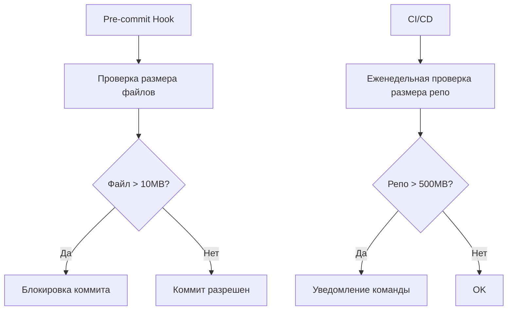

# 📦 Repository Management

**Версия:** 2025-08-05 **Статус:** ✅ Canonical

Лучшие практики управления репозиторием NEIRA Super App: размер, бинарные файлы, архитектура хранения.

---

## 1. 🎯 Философия и принципы

1. **Минимальный размер** — только исходный код и необходимые ресурсы
2. **Быстрое клонирование** — время клонирования не должно превышать разумных пределов
3. **Правильная структура** — четкое разделение исходного кода и артефактов сборки
4. **Автоматизация** — максимальная автоматизация управления зависимостями

---

## 2. 🗂️ Управление бинарными файлами

### 2.1 Правила

- **Исходный код только** — репозиторий содержит только исходный код и конфигурации
- **Сборочные артефакты исключены** — все результаты сборки генерируются локально или в CI
- **Git LFS для файлов >10MB** — большие файлы должны использовать Git LFS
- **Регулярная очистка** — периодическая проверка и удаление ненужных файлов

### 2.2 Ключевые исключения .gitignore

```gitignore
# Build artifacts
dist/
build/
out/
node_modules/

# Native messaging host binaries
**/native-messaging-host/crxtesthost*
**/native-messaging-host/*.blob
**/native-messaging-host/dist/
```

---

## 3. ✅ Решенные проблемы

### 3.1 Удаление больших бинарных файлов (REPO:LARGE_BINARIES_CLEANUP)

**Проблема:** Большие бинарные файлы (~85MB) в репозитории замедляли клонирование и нарушали best practices.

**Решение:**

1. Добавлены правила в корневой `.gitignore` для игнорирования артефактов нативного хоста
2. Файл удалён из индекса Git с помощью `git rm --cached`
3. Подготовлены инструкции для очистки истории через `git-filter-repo`

**Результат:** Размер репозитория уменьшен, предотвращено повторное добавление артефактов сборки.

---

## 4. 📊 Мониторинг размера

### 4.1 Быстрые проверки

```bash
# Размер репозитория
du -sh .git/

# Поиск файлов >10MB
find . -type f -size +10M | head -10
```

### 4.2 Pre-commit hook

```bash
#!/bin/bash
# scripts/check-file-sizes.sh
MAX_SIZE_MB=10
large_files=$(find . -type f -size +${MAX_SIZE_MB}M -not -path "./.git/*" -not -path "./node_modules/*")

if [ -n "$large_files" ]; then
    echo "⚠️  Найдены файлы больше ${MAX_SIZE_MB}MB:"
    echo "$large_files"
    exit 1
fi
```

---

## 5. 🧹 Очистка истории Git

### 5.1 Рекомендуемый инструмент: git-filter-repo

```bash
# Установка
pip install git-filter-repo

# Удаление файла из всей истории
git filter-repo --path path/to/large/file --invert-paths
```

### 5.2 ⚠️ Координация команды

Очистка истории Git требует:

1. **Уведомление команды** заранее
2. **Синхронизация** — все делают push перед операцией
3. **Пересоздание форков** после очистки
4. **Обновление CI/CD** кэшей

---

## 6. 🏆 Лучшие практики

### 6.1 Мониторинг



### 6.2 Альтернативы для больших файлов

| Тип файла | Решение | Инструмент |
|-----------|---------|------------|
| Изображения | Оптимизация + CDN | tinypng, imagemin |
| Видео/аудио | Внешнее хранение | YouTube, Vimeo |
| Большие данные | Git LFS | git lfs |
| Артефакты сборки | Генерация при сборке | CI/CD |

---

## 7. 🔧 Troubleshooting

### 7.1 Частые проблемы

| Проблема | Решение |
|----------|---------|
| Медленное клонирование | Очистка истории с `git-filter-repo` |
| Превышение лимита GitHub (1GB) | Миграция в Git LFS |
| Долгая загрузка в CI | Shallow clone: `git clone --depth=1` |

### 7.2 Экстренное восстановление

```bash
# Если случайно добавили большой файл
git rm --cached path/to/large/file
git commit --amend

# Если файл уже в нескольких коммитах
git filter-repo --path path/to/large/file --invert-paths
```

---

## 8. 📋 CI/CD интеграция

Автоматическая проверка размера репозитория в GitHub Actions:

```yaml
# .github/workflows/repository-health.yml
name: Repository Health Check
on: [pull_request]
jobs:
  check-repo-size:
    runs-on: ubuntu-latest
    steps:
      - uses: actions/checkout@v3
        with:
          fetch-depth: 0
      - name: Check repository size
        run: |
          REPO_SIZE=$(du -sm .git | cut -f1)
          if [ $REPO_SIZE -gt 500 ]; then
            echo "⚠️ Repository size exceeds 500MB"
            exit 1
          fi
      - name: Check for large files
        run: bash scripts/check-file-sizes.sh
```

---

## 9. 📦 Управление зависимостями

### 9.1 Регулярная чистка зависимостей (REPO:DEPENDENCY_CLEANUP_2025_01)

**Проблема:** Неиспользуемые зависимости загромождают package.json, отсутствует регулярный аудит зависимостей.

**Решение:**

- Удалены неиспользуемые прямые зависимости и devDependencies
- Зафиксированы версии критических пакетов (electron, next.js)
- Настроены скрипты `yarn depcheck` и `yarn lint:deps` в CI
- Автоматический PR от Renovate с контролируемыми обновлениями

**Результат:** Ежемесячный аудит зависимостей, предотвращение несовместимых мажорных обновлений, автоматизированное управление.

### 9.2 Автоматизированные инструменты

```bash
# Поиск неиспользуемых зависимостей
yarn depcheck

# Аудит безопасности
yarn audit

# Обновление зависимостей
yarn upgrade-interactive --latest
```

### 9.3 Политика обновлений

| Тип обновления | Автоматизация | Требования |
|----------------|---------------|------------|
| Patch (x.x.X) | Автоматически | CI проходит |
| Minor (x.X.x) | PR от Renovate | Manual review |
| Major (X.x.x) | Manual only | Полное тестирование |

---

## 10. 📚 Связанные документы

- [Development Checklist](/05-contributing/02-development-checklist) — Чек-лист для разработчиков
- [Code Quality Standards](/05-contributing/05-code-quality-standards) — Стандарты качества кода
- [Dependency Management](/05-contributing/08-dependency-management) — Управление зависимостями

---

## 10. 📝 История изменений

| Дата | Версия | Изменение | ID Знания |
|------|--------|-----------|-----------|
| 2025-08-05 | 1.0 | Создание документа, интеграция опыта удаления больших файлов | REPO:LARGE_BINARIES_REMOVAL |
| 2025-08-05 | 1.1 | Оптимизация до 250 строк, добавлена mermaid диаграмма | DOCBUILDER:OPTIMIZATION |
